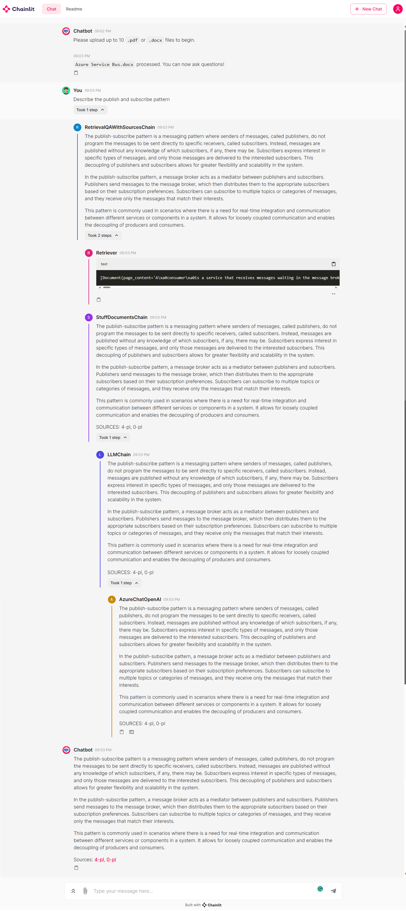
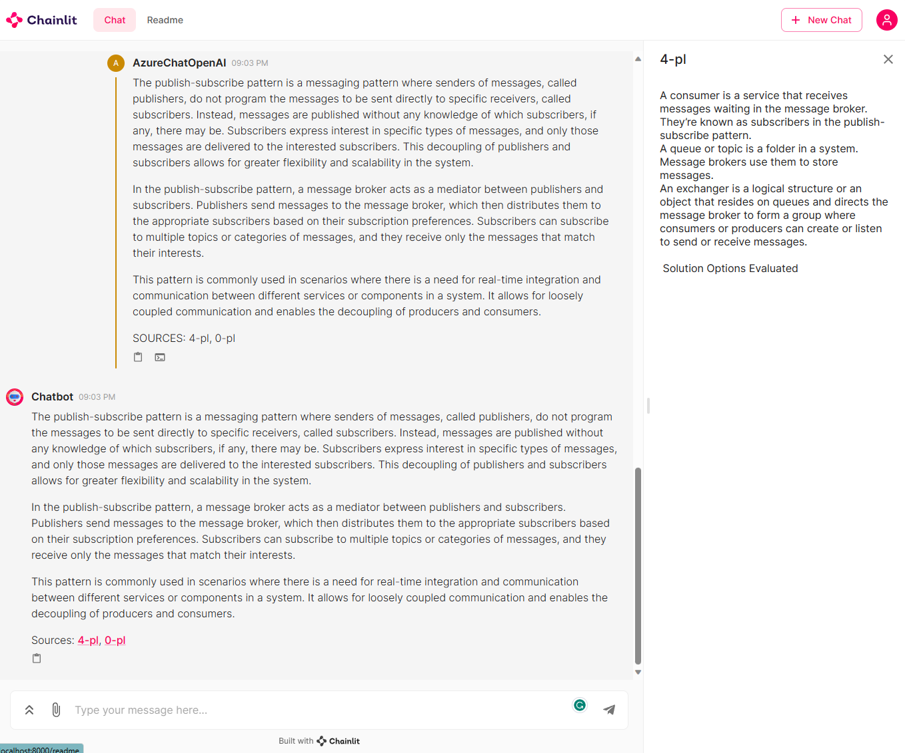

# Deploy an OpenAI, LangChain, ChromaDB, and Chainlit chat app in Azure Kubernetes Service using Terraform

In this sample, I demonstrate how to quickly build chat applications using [Python](https://www.python.org/) and leveraging powerful technologies such as [OpenAI ChatGPT models](https://platform.openai.com/docs/guides/gpt), [Embedding models](https://learn.microsoft.com/en-us/azure/ai-services/openai/concepts/models#embeddings-models), [LangChain](https://python.langchain.com/docs/get_started/introduction.html) framework, [ChromaDB](https://docs.trychroma.com/) vector database, and [Chainlit](https://docs.chainlit.io/overview), an open-source Python package that is specifically designed to create user interfaces (UIs) for AI applications. These applications are hosted in an [Azure Kubernetes Service (AKS)](https://docs.microsoft.com/en-us/azure/aks/intro-kubernetes) cluster that communicates with [Azure OpenAI Service (AOAI)](https://learn.microsoft.com/en-us/azure/cognitive-services/openai/overview) via an [Azure Private Endpoint](https://docs.microsoft.com/en-us/azure/private-link/private-endpoint-overview).

- **Simple Chat**: This simple chat application utilizes OpenAI's language models to generate real-time completion responses.
- **Documents QA Chat**: This chat application goes beyond simple conversations. Users can upload up to 10 `.pdf` and `.docx` documents, which are then processed to create vector embeddings. These embeddings are stored in [ChromaDB](https://docs.trychroma.com/) for efficient retrieval. Users can pose questions about the uploaded documents and view the [Chain of Thought](https://docs.chainlit.io/concepts/chain-of-thought),  enabling easy exploration of the reasoning process. The completion message contains links to the text chunks in the documents that were used as a source for the response.

Both applications use a [user-defined managed identity](https://learn.microsoft.com/en-us/azure/active-directory/managed-identities-azure-resources/overview) to authenticate and authorize against [Azure OpenAI Service (AOAI)](https://learn.microsoft.com/en-us/azure/ai-services/openai/overview) and [Azure Container Registry (ACR)](https://learn.microsoft.com/en-us/azure/container-registry/) and use [Azure Private Endpoints](https://learn.microsoft.com/en-us/azure/private-link/private-endpoint-overview) to connect privately and securely to these services. The chat UIs are built using [Chainlit](https://docs.chainlit.io/overview), an open-source Python package designed explicitly for creating AI applications. Chainlit seamlessly integrates with [LangChain](https://python.langchain.com/docs/get_started/introduction.html), [LlamaIndex](https://gpt-index.readthedocs.io/en/latest/), and [LangFlow](https://github.com/logspace-ai/langflow), making it a powerful tool for developing ChatGPT-like applications with ease.

For more information on Azure OpenAI Service and Large Language Models (LLMs), see the following articles:

- [What is Azure OpenAI Service?](https://learn.microsoft.com/en-us/azure/cognitive-services/openai/overview)
- [Azure OpenAI Service models](https://learn.microsoft.com/en-us/azure/cognitive-services/openai/concepts/models)
- [Large Language Model](https://en.wikipedia.org/wiki/Large_language_model)

> **NOTE**  
> You can find the `architecture.vsdx` file used for the diagram under the `visio` folder.

## Prerequisites

- An active [Azure subscription](https://docs.microsoft.com/en-us/azure/guides/developer/azure-developer-guide#understanding-accounts-subscriptions-and-billing). If you don't have one, create a [free Azure account](https://azure.microsoft.com/free/) before you begin.
- [Visual Studio Code](https://code.visualstudio.com/) installed on one of the [supported platforms](https://code.visualstudio.com/docs/supporting/requirements#_platforms) along with the [HashiCorp Terraform](https://marketplace.visualstudio.com/items?itemName=HashiCorp.terraform).
- Azure CLI version 2.49.0 or later installed. To install or upgrade, see [Install Azure CLI](https://learn.microsoft.com/en-us/cli/azure/install-azure-cli).
- `aks-preview` Azure CLI extension of version 0.5.140 or later installed
- [Terraform v1.5.2 or later](https://developer.hashicorp.com/terraform/downloads).
- The deployment must be started by a user who has sufficient permissions to assign roles, such as a `User Access Administrator` or `Owner`.
- Your Azure account also needs `Microsoft.Resources/deployments/write` permissions at the subscription level.

## Architecture

The following diagram shows the architecture and network topology deployed by the sample:


This project provides a set of Terraform modules to deploy thw following resources:

- [Azure Kubernetes Service](https://registry.terraform.io/providers/hashicorp/azurerm/latest/docs/resources/kubernetes_cluster):  A public or private [Azure Kubernetes Service(AKS)](https://docs.microsoft.com/en-us/azure/aks/intro-kubernetes) cluster composed of a:
  - A `system` node pool in a dedicated subnet. The default node pool hosts only critical system pods and services. The worker nodes have node taint which prevents application pods from beings scheduled on this node pool.
  - A `user` node pool hosting user workloads and artifacts in a dedicated subnet.
- [Azure OpenAI Service](https://registry.terraform.io/providers/hashicorp/azurerm/latest/docs/resources/cognitive_account): an [Azure OpenAI Service](https://learn.microsoft.com/en-us/azure/cognitive-services/openai/overview) with a [GPT-3.5](https://learn.microsoft.com/en-us/azure/cognitive-services/openai/concepts/models#chatgpt-gpt-35-turbo) model used by the chatbot application. Azure OpenAI Service gives customers advanced language AI with OpenAI GPT-4, GPT-3, Codex, and DALL-E models with the security and enterprise promise of Azure. Azure OpenAI co-develops the APIs with OpenAI, ensuring compatibility and a smooth transition from one to the other.
- [User-defined Managed Identity](https://registry.terraform.io/providers/hashicorp/azurerm/latest/docs/resources/user_assigned_identity): a user-defined managed identity used by the AKS cluster to create additional resources like load balancers and managed disks in Azure.
- [User-defined Managed Identity](https://registry.terraform.io/providers/hashicorp/azurerm/latest/docs/resources/user_assigned_identity): a user-defined managed identity used by the chatbot application to acquire a security token via [Microsoft Entra Workload ID](https://learn.microsoft.com/en-us/azure/aks/workload-identity-overview) to call the [Chat Completion API](https://platform.openai.com/docs/api-reference/chat) of the [ChatGPT model](https://learn.microsoft.com/en-us/azure/cognitive-services/openai/concepts/models#chatgpt-gpt-35-turbo) provided by the [Azure OpenAI Service](https://learn.microsoft.com/en-us/azure/cognitive-services/openai/overview).
- [Azure Virtual Machine](https://registry.terraform.io/providers/hashicorp/azurerm/latest/docs/resources/linux_virtual_machine): Terraform modules can optionally create a jump-box virtual machine to manage the private AKS cluster.
- [Azure Bastion Host](https://registry.terraform.io/providers/hashicorp/azurerm/latest/docs/resources/bastion_host): a separate Azure Bastion is deployed in the AKS cluster virtual network to provide SSH connectivity to both agent nodes and virtual machines.
- [Azure NAT Gateway](https://registry.terraform.io/providers/hashicorp/azurerm/latest/docs/resources/nat_gateway): a bring-your-own (BYO) [Azure NAT Gateway](https://learn.microsoft.com/en-us/azure/virtual-network/nat-gateway/nat-overview) to manage outbound connections initiated by AKS-hosted workloads. The NAT Gateway is associated to the `SystemSubnet`, `UserSubnet`, and `PodSubnet` subnets. The [outboundType](https://learn.microsoft.com/en-us/azure/aks/egress-outboundtype#outbound-type-of-managednatgateway-or-userassignednatgateway) property of the cluster is set to `userAssignedNatGateway` to specify that a BYO NAT Gateway is used for outbound connections. NOTE: you can update the `outboundType` after cluster creation and this will deploy or remove resources as required to put the cluster into the new egress configuration. For more information, see [Updating outboundType after cluster creation](https://learn.microsoft.com/en-us/azure/aks/egress-outboundtype#updating-outboundtype-after-cluster-creation-preview).
- [Azure Storage Account](https://registry.terraform.io/providers/hashicorp/azurerm/latest/docs/resources/storage_account): this storage account is used to store the boot diagnostics logs of both the service provider and service consumer virtual machines. Boot Diagnostics is a debugging feature that allows you to view console output and screenshots to diagnose virtual machine status.
- [Azure Container Registry](https://registry.terraform.io/providers/hashicorp/azurerm/latest/docs/resources/container_registry): an Azure Container Registry (ACR) to build, store, and manage container images and artifacts in a private registry for all container deployments.
- [Azure Key Vault](https://registry.terraform.io/providers/hashicorp/azurerm/latest/docs/resources/key_vault): an Azure Key Vault used to store secrets, certificates, and keys that can be mounted as files by pods using [Azure Key Vault Provider for Secrets Store CSI Driver](https://github.com/Azure/secrets-store-csi-driver-provider-azure). For more information, see [Use the Azure Key Vault Provider for Secrets Store CSI Driver in an AKS cluster](https://learn.microsoft.com/en-us/azure/aks/csi-secrets-store-driver) and [Provide an identity to access the Azure Key Vault Provider for Secrets Store CSI Driver](https://learn.microsoft.com/en-us/azure/aks/csi-secrets-store-identity-access).
- [Azure Private Endpoints](https://registry.terraform.io/providers/hashicorp/azurerm/latest/docs/resources/private_endpoint): an [Azure Private Endpoint](https://docs.microsoft.com/en-us/azure/private-link/private-endpoint-overview) is created for each of the following resources:
  - Azure OpenAI Service
  - Azure Container Registry
  - Azure Key Vault
  - Azure Storage Account
  - API Server when deploying a private AKS cluster.
- [Azure Private DNDS Zones](https://registry.terraform.io/providers/hashicorp/azurerm/latest/docs/data-sources/private_dns_zone): an [Azure Private DNS Zone](https://docs.microsoft.com/en-us/azure/dns/private-dns-overview) is created for each of the following resources:
  - Azure OpenAI Service
  - Azure Container Registry
  - Azure Key Vault
  - Azure Storage Account
  - API Server when deploying a private AKS cluster.
- [Azure Network Security Group](https://registry.terraform.io/providers/hashicorp/azurerm/latest/docs/data-sources/network_security_group): subnets hosting virtual machines and Azure Bastion Hosts are protected by [Azure Network Security Groups](https://docs.microsoft.com/en-us/azure/virtual-network/network-security-groups-overview) that are used to filter inbound and outbound traffic.
- [Azure Log Analytics Workspace](https://registry.terraform.io/providers/hashicorp/azurerm/latest/docs/resources/log_analytics_workspace): a centralized [Azure Log Analytics](https://docs.microsoft.com/en-us/azure/azure-monitor/logs/log-analytics-workspace-overview) workspace is used to collect the diagnostics logs and metrics from all the Azure resources:
  - Azure OpenAI Service
  - Azure Kubernetes Service cluster
  - Azure Key Vault
  - Azure Network Security Group
  - Azure Container Registry
  - Azure Storage Account
  - Azure jump-box virtual machine
- [Azure Monitor workspace](https://registry.terraform.io/providers/hashicorp/azurerm/3.83.0/docs/resources/monitor_workspace): An [Azure Monitor workspace](https://learn.microsoft.com/en-us/azure/azure-monitor/essentials/azure-monitor-workspace-overview) is a unique environment for data collected by [Azure Monitor](https://learn.microsoft.com/en-us/azure/azure-monitor/essentials/data-platform-metrics). Each workspace has its own data repository, configuration, and permissions. Log Analytics workspaces contain logs and metrics data from multiple Azure resources, whereas Azure Monitor workspaces currently contain only metrics related to [Prometheus](https://learn.microsoft.com/en-us/azure/azure-monitor/essentials/prometheus-metrics-overview). Azure Monitor managed service for Prometheus allows you to collect and analyze metrics at scale using a Prometheus-compatible monitoring solution, based on the [Prometheus](https://aka.ms/azureprometheus-promio). This fully managed service allows you to use the [Prometheus query language (PromQL)](https://aka.ms/azureprometheus-promio-promql) to analyze and alert on the performance of monitored infrastructure and workloads without having to operate the underlying infrastructure. The primary method for visualizing Prometheus metrics is [Azure Managed Grafana](https://learn.microsoft.com/en-us/azure/managed-grafana/overview). You can connect your [Azure Monitor workspace](https://learn.microsoft.com/en-us/azure/azure-monitor/essentials/azure-monitor-workspace-overview) to an [Azure Managed Grafana](https://learn.microsoft.com/en-us/azure/managed-grafana/overview) to visualize Prometheus metrics using a set of built-in and custom Grafana dashboards.
- [Azure Managed Grafana](https://registry.terraform.io/providers/hashicorp/azurerm/latest/docs/resources/dashboard_grafana): an [Azure Managed Grafana](https://learn.microsoft.com/en-us/azure/managed-grafana/overview) instance used to visualize the [Prometheus metrics](https://learn.microsoft.com/en-us/azure/azure-monitor/containers/prometheus-metrics-enable?tabs=azure-portal) generated by the [Azure Kubernetes Service(AKS)](https://docs.microsoft.com/en-us/azure/aks/intro-kubernetes) cluster deployed by the Bicep modules. [Azure Managed Grafana](https://learn.microsoft.com/en-us/azure/managed-grafana/overview) is a fully managed service for analytics and monitoring solutions. It's supported by Grafana Enterprise, which provides extensible data visualizations. This managed service allows to quickly and easily deploy Grafana dashboards with built-in high availability and control access with Azure security.
- [NGINX Ingress Controller](https://docs.nginx.com/nginx-ingress-controller/): this sample compares the managed and unmanaged NGINX Ingress Controller. While the managed version is installed using the [Application routing add-on](https://learn.microsoft.com/en-us/azure/aks/app-routing), the unmanaged version is deployed using the [Helm Terraform Provider](https://registry.terraform.io/providers/hashicorp/helm/latest/docs). You can use the Helm provider to deploy software packages in Kubernetes. The provider needs to be configured with the proper credentials before it can be used.
- [Cert-Manager](https://cert-manager.io/docs/): the `cert-manager` package and [Let's Encrypt](https://letsencrypt.org/) certificate authority are used to issue a TLS/SSL certificate to the chat applications.
- [Prometheus](https://prometheus.io/): the AKS cluster is configured to collect metrics to the [Azure Monitor workspace](https://learn.microsoft.com/en-us/azure/azure-monitor/essentials/azure-monitor-workspace-overview) and [Azure Managed Grafana](https://learn.microsoft.com/en-us/azure/managed-grafana/overview). Nonetheless, the [kube-prometheus-stack](https://artifacthub.io/packages/helm/prometheus-community/kube-prometheus-stack) Helm chart is used to install [Prometheus](https://prometheus.io/) and [Grafana](https://grafana.com/) on the AKS cluster.
- Workload namespace and service account: the [Kubectl Terraform Provider](https://registry.terraform.io/providers/cpanato/kubectl/latest/docs) and [Kubernetes Terraform Provider](https://registry.terraform.io/providers/hashicorp/kubernetes/latest/docs) are used to create the namespace and service account used by the chat applications.
- Azure Monitor ConfigMaps for [Azure Monitor managed service for Prometheus](https://learn.microsoft.com/en-us/azure/azure-monitor/essentials/prometheus-metrics-overview) and `cert-manager` [Cluster Issuer](https://cert-manager.io/docs/configuration/) are deployed using the [Kubectl Terraform Provider](https://registry.terraform.io/providers/cpanato/kubectl/latest/docs) and [Kubernetes Terraform Provider](https://registry.terraform.io/providers/hashicorp/kubernetes/latest/docs).`

The architecture of the `chat` application can be seen in the image below. The same architecture is also adopted by the `docs` application.


The technologies and frameworks utilized by both applications are depicted in the next figure. Both applications are written in Python.


> **NOTE**  
> In a production environment, we strongly recommend deploying a [private AKS cluster](https://docs.microsoft.com/en-us/azure/aks/private-clusters) with [Uptime SLA](https://docs.microsoft.com/en-us/azure/aks/uptime-sla). For more information, see [private AKS cluster with a Public DNS address](https://docs.microsoft.com/en-us/azure/aks/private-clusters#create-a-private-aks-cluster-with-a-public-dns-address). Alternatively, you can deploy a public AKS cluster and secure access to the API server using [authorized IP address ranges](https://learn.microsoft.com/en-us/azure/aks/api-server-authorized-ip-ranges).

## What is Azure OpenAI Service?

The [Azure OpenAI Service](https://learn.microsoft.com/en-us/azure/cognitive-services/openai/overview) is a platform offered by Microsoft Azure that provides cognitive services powered by [OpenAI](https://openai.com/) models. One of the models available through this service is the [ChatGPT](https://learn.microsoft.com/en-us/azure/cognitive-services/openai/concepts/models#gpt-4-models) model, which is designed for interactive conversational tasks. It allows developers to integrate natural language understanding and generation capabilities into their applications.

Azure OpenAI Service provides REST API access to OpenAI's powerful language models including the [GPT-3](https://learn.microsoft.com/en-us/azure/cognitive-services/openai/concepts/models#gpt-3-models), [Codex](https://learn.microsoft.com/en-us/azure/cognitive-services/openai/concepts/models#codex-models) and [Embeddings](https://learn.microsoft.com/en-us/azure/cognitive-services/openai/concepts/models#codex-models) model series. In addition, the new [GPT-4](https://learn.microsoft.com/en-us/azure/cognitive-services/openai/concepts/models#gpt-4-models) and [ChatGPT](https://learn.microsoft.com/en-us/azure/cognitive-services/openai/concepts/models#chatgpt-gpt-35-turbo) model series have now reached general availability. These models can be easily adapted to your specific task including but not limited to content generation, summarization, semantic search, and natural language to code translation. Users can access the service through REST APIs, Python SDK, or our web-based interface in the Azure OpenAI Studio.

The [Chat Completion API](https://platform.openai.com/docs/api-reference/chat/create), which is part of the Azure OpenAI Service, provides a dedicated interface for interacting with the [ChatGPT](https://learn.microsoft.com/en-us/azure/cognitive-services/openai/concepts/models#chatgpt-gpt-35-turbo) and [GPT-4 models](https://learn.microsoft.com/en-us/azure/cognitive-services/openai/concepts/models#gpt-4-models). This API is currently in preview and is the preferred method for accessing these models. The GPT-4 models can only be accessed through this API.

[GPT-3](https://learn.microsoft.com/en-us/azure/cognitive-services/openai/concepts/models#gpt-3-models), [GPT-3.5](https://learn.microsoft.com/en-us/azure/cognitive-services/openai/concepts/models#chatgpt-gpt-35-turbo), and [GPT-4](https://learn.microsoft.com/en-us/azure/cognitive-services/openai/concepts/models#gpt-4-models) models from OpenAI are prompt-based. With prompt-based models, the user interacts with the model by entering a text prompt, to which the model responds with a text completion. This completion is the model’s continuation of the input text. While these models are extremely powerful, their behavior is also very sensitive to the prompt. This makes prompt construction an important skill to develop. For more information, see [Introduction to prompt engineering](https://learn.microsoft.com/en-us/azure/cognitive-services/openai/concepts/prompt-engineering).

Prompt construction can be difficult. In practice, the prompt acts to configure the model weights to complete the desired task, but it's more of an art than a science, often requiring experience and intuition to craft a successful prompt. The goal of this article is to help get you started with this learning process. It attempts to capture general concepts and patterns that apply to all GPT models. However it's important to understand that each model behaves differently, so the learnings may not apply equally to all models.

Prompt engineering refers to the process of creating instructions called prompts for Large Language Models (LLMs), such as OpenAI’s ChatGPT. With the immense potential of LLMs to solve a wide range of tasks, leveraging prompt engineering can empower us to save significant time and facilitate the development of impressive applications. It holds the key to unleashing the full capabilities of these huge models, transforming how we interact and benefit from them. For more information, see [Prompt engineering techniques](https://learn.microsoft.com/en-us/azure/cognitive-services/openai/concepts/advanced-prompt-engineering?pivots=programming-language-chat-completions).

## Vector Databases

A [vector database](https://learn.microsoft.com/en-us/semantic-kernel/memories/vector-db) is a specialized database that goes beyond traditional storage by organizing information to simplify the search for similar items. Instead of merely storing words or numbers, it leverages vector embeddings - unique numerical representations of data. These embeddings capture meaning, context, and relationships. For instance, words are represented as vectors, whereas similar words have similar vector values.

The applications of vector databases are numerous and powerful. In language processing, they facilitate the discovery of related documents or sentences. By comparing the vector embeddings of different texts, finding similar or related information becomes faster and more efficient. This capability benefits search engines and recommendation systems, which can suggest relevant articles or products based on user interests.

In the realm of image analysis, vector databases excel in finding visually similar images. By representing images as vectors, a simple comparison of vector values can identify visually similar images. This capability is highly valuable for tasks like reverse image search or content-based image retrieval.

Additionally, vector databases find applications in fraud detection, anomaly detection, and clustering. By comparing vector embeddings of data points, unusual patterns can be detected, and similar items can be grouped together, aiding in effective data analysis and decision-making.

Here is a list of the most popular vector databases:

- [ChromaDB](https://docs.trychroma.com/) is a powerful database solution that stores and retrieves vector embeddings efficiently. It is commonly used in AI applications, including chatbots and document analysis systems. By storing embeddings in ChromaDB, users can easily search and retrieve similar vectors, enabling faster and more accurate matching or recommendation processes. ChromaDB offers excellent scalability high performance, and supports various indexing techniques to optimize search operations. It is a versatile tool that enhances the functionality and efficiency of AI applications that rely on vector embeddings.
- [Facebook AI Similarity Search (FAISS)](https://faiss.ai/index.html) is another widely used vector database. Facebook AI Research develops it and offers highly optimized algorithms for similarity search and clustering of vector embeddings. FAISS is known for its speed and scalability, making it suitable for large-scale applications. It offers different indexing methods like flat, IVF (Inverted File System), and HNSW (Hierarchical Navigable Small World) to organize and search vector data efficiently.
- [SingleStore](https://www.singlestore.com/): SingleStore aims to deliver the world’s fastest distributed SQL database for data-intensive applications: SingleStoreDB, which combines transactional + analytical workloads in a single platform.
- [Astra DB](https://www.datastax.com/products/datastax-astra): [DataStax](https://www.datastax.com/) Astra DB is a cloud-native, multi-cloud, fully managed database-as-a-service based on Apache Cassandra, which aims to accelerate application development and reduce deployment time for applications from weeks to minutes.
- [Milvus](https://milvus.io/): Milvus is an open source vector database built to power embedding similarity search and AI applications. Milvus makes unstructured data search more accessible and provides a consistent user experience regardless of the deployment environment. Milvus 2.0 is a cloud-native vector database with storage and computation separated by design. All components in this refactored version of Milvus are stateless to enhance elasticity and flexibility.
- [Qdrant](https://qdrant.tech/): Qdrant is a vector similarity search engine and database for AI applications. Along with open-source, Qdrant is also available in the cloud. It provides a production-ready service with an API to store, search, and manage points—vectors with an additional payload. Qdrant is tailored to extended filtering support. It makes it useful for all sorts of neural-network or semantic-based matching, faceted search, and other applications.
- [Pinecone](https://www.pinecone.io/): Pinecone is a fully managed vector database that makes adding vector search to production applications accessible. It combines state-of-the-art vector search libraries, advanced features such as filtering, and distributed infrastructure to provide high performance and reliability at any scale.
- [Vespa](https://vespa.ai/): Vespa is a platform for applications combining data and AI, online. By building such applications on Vespa helps users avoid integration work to get features, and it can scale to support any amount of traffic and data. To deliver that, Vespa provides a broad range of query capabilities, a computation engine with support for modern machine-learned models, hands-off operability, data management, and application development support. It is free and open source to use under the Apache 2.0 license.
- [Zilliz](https://zilliz.com/): Milvus is an open-source vector database, with over 18,409 stars on GitHub and 3.4 million+ downloads. Milvus supports billion-scale vector search and has over 1,000 enterprise users. Zilliz Cloud provides a fully-managed Milvus service made by the creators of Milvus. This helps to simplify the process of deploying and scaling vector search applications by eliminating the need to create and maintain complex data infrastructure. As a DBaaS, Zilliz simplifies the process of deploying and scaling vector search applications by eliminating the need to create and maintain complex data infrastructure.
- [Weaviate](https://weaviate.io/): Weaviate is an open-source vector database used to store data objects and vector embeddings from ML-models, and scale into billions of data objects from the same name company in Amsterdam. Users can index billions of data objects to search through and combine multiple search techniques, such as keyword-based and vector search, to provide search experiences.

This sample makes of [ChromaDB](https://docs.trychroma.com/) vector database, but you can easily modify the code to use another vector database. You can even use [Azure Cache for Redis Enterprise](https://learn.microsoft.com/en-us/azure/azure-cache-for-redis/cache-overview) to store the vector embeddings and compute vector similarity with high performance and low latency. For more information, see [Vector Similarity Search with Azure Cache for Redis Enterprise](https://techcommunity.microsoft.com/t5/azure-developer-community-blog/vector-similarity-search-with-azure-cache-for-redis-enterprise/ba-p/3822059)

## LangChain

[LangChain](https://python.langchain.com/docs/get_started/introduction.html) is a software framework designed to streamline the development of applications using [large language models (LLMs)](https://en.wikipedia.org/wiki/Large_language_model). It serves as a language model integration framework, facilitating various applications like document analysis and summarization, chatbots, and code analysis.

LangChain's integrations cover an extensive range of systems, tools, and services, making it a comprehensive solution for language model-based applications. LangChain integrates with the major cloud platforms such as Microsoft Azure, Amazon AWS, and Google, and with API wrappers for various purposes like news, movie information, and weather, as well as support for Bash, web scraping, and more. It also supports multiple language models, including those from OpenAI, Anthropic, and Hugging Face. Moreover, LangChain offers various functionalities for document handling, code generation, analysis, debugging, and interaction with databases and other data sources.

## Chainlit

[Chainlit](https://docs.chainlit.io/overview) is an open-source Python package that is specifically designed to create user interfaces (UIs) for AI applications. It simplifies the process of building interactive chats and interfaces, making developing AI-powered applications faster and more efficient. While Streamlit is a general-purpose UI library, Chainlit is purpose-built for AI applications and seamlessly integrates with other AI technologies such as [LangChain](https://python.langchain.com/docs/get_started/introduction.html), [LlamaIndex](https://gpt-index.readthedocs.io/en/latest/), and [LangFlow](https://github.com/logspace-ai/langflow).

With Chainlit, developers can easily create intuitive UIs for their AI models, including ChatGPT-like applications. It provides a user-friendly interface for users to interact with AI models, enabling conversational experiences and information retrieval. Chainlit also offers unique features, such as the ability to display the [Chain of Thought](https://docs.chainlit.io/concepts/chain-of-thought), which allows users to explore the reasoning process directly within the UI. This feature enhances transparency and enables users to understand how the AI arrives at its responses or recommendations.

For more information, see the following resources:

- [Documentation](https://docs.chainlit.io/overview)
- [Examples](https://docs.chainlit.io/examples/community)
- [API Reference](https://docs.chainlit.io/api-reference/on-message)
- [Cookbook](https://docs.chainlit.io/examples/cookbook)

## Managed NGINX Ingress Controller for Azure Kubernetes Service

One way to route HTTP and secure HTTPS traffic to applications in an Azure Kubernetes Service (AKS) cluster is by using the Kubernetes Ingress object. The application routing add-on for AKS enables you to create, configure, and manage one or more Ingress controllers within your AKS cluster using the [NGINX Ingress Controller](https://docs.nginx.com/nginx-ingress-controller/).

The application routing add-on with NGINX provides several features, including:

- Easy configuration of managed NGINX Ingress controllers based on the Kubernetes NGINX Ingress controller.
- Integration with Azure DNS for public and private zone management.
- SSL termination with certificates stored in Azure Key Vault.

To enable the [application routing add-on](https://learn.microsoft.com/en-us/azure/aks/app-routing?tabs=default%2Cdeploy-app-default) on an existing cluster, you can use Azure CLI, as shown in the following code snippet.

```bash
az aks approuting enable -g <ResourceGroupName> -n <ClusterName>
```

Once enabled, you can connect to your AKS cluster, deploy applications, and create Ingress objects with appropriate annotations for routing. There are some limitations to be aware of, such as the maximum number of supported Azure DNS zones and namespace editing restrictions. It's recommended to review the [application routing add-on configuration](https://learn.microsoft.com/en-us/azure/aks/app-routing-dns-ssl) for additional information on SSL encryption and DNS integration.

If you are familiar with the NGINX ingress controller, you can just replace the `nginx` ingress class name inside an ingress object with the name of the ingress controller deployed by the application routing addon, that, by default is equal to `webapprouting.kubernetes.azure.com`:

```yaml
apiVersion: networking.k8s.io/v1
kind: Ingress
metadata:
  name: chat-ingress-webapprouting
  annotations:
    cert-manager.io/cluster-issuer: letsencrypt-webapprouting
    cert-manager.io/acme-challenge-type: http01 
    nginx.ingress.kubernetes.io/affinity: "cookie"
    nginx.ingress.kubernetes.io/proxy-connect-timeout: "3600"
    nginx.ingress.kubernetes.io/proxy-send-timeout: "3600"
    nginx.ingress.kubernetes.io/proxy-read-timeout: "3600"
    nginx.ingress.kubernetes.io/proxy-next-upstream-timeout: "3600"
    nginx.ingress.kubernetes.io/enable-cors: "true"
    nginx.ingress.kubernetes.io/cors-allow-origin: "*"
    nginx.ingress.kubernetes.io/cors-allow-credentials: "false"
spec:
  ingressClassName: webapprouting.kubernetes.azure.com
  tls:
  - hosts:
    - chat.babosbird.com
    secretName: chat-tls-secret-webapprouting
  rules:
  - host: chat.babosbird.com
    http:
      paths:
      - path: /
        pathType: Prefix
        backend:
          service:
            name: chat
            port:
              number: 8000
```

If you leverage `cert-manager` and with Let's Encrypt certificate authority to issue TLS/SSL certificates to your application, make sure to create an issuer or a cluster issuer for the ingress class of the managed NGINX ingress controller installed by the application routing add-on. This can be done using the sample code provided below:

```yaml
apiVersion: cert-manager.io/v1
kind: ClusterIssuer
metadata:
  annotations:
  name: letsencrypt-webapprouting
spec:
  acme:
    email: admin@contoso.com
    privateKeySecretRef:
      name: letsencrypt-webapprouting
    server: https://acme-v02.api.letsencrypt.org/directory
    solvers:
    - http01:
        ingress:
          class: webapprouting.kubernetes.azure.com
          podTemplate:
            metadata: {}
            spec:
              nodeSelector:
                kubernetes.io/os: linux
```

Ensure that you replace `admin@contoso.com` with your own email address to receive notifications from Let's Encrypt. By using this configuration, `cert-manager` will be able to issue certificates for the ingress class of the managed NGINX ingress controller when using the application routing add-on. Please note that the server URL `https://acme-v02.api.letsencrypt.org/directory` is the Let's Encrypt production server. You can also use the staging server `https://acme-staging-v02.api.letsencrypt.org/directory` for testing purposes to avoid rate limits. Ensure that the issuer or cluster issuer resource is deployed to your Kubernetes cluster, and `cert-manager` is properly installed and configured.

For more detailed steps and instructions, refer to [Managed nginx Ingress with the application routing add-on](https://learn.microsoft.com/en-us/azure/aks/app-routing?tabs=default%2Cdeploy-app-default).

## Deploy the Terraform modules

Before deploying the Terraform modules in the `terraform` folder, specify a value for the following variables in the [terraform.tfvars](https://developer.hashicorp.com/terraform/language/values/variables#variable-definitions-tfvars-files) variable definitions file.

```terraform
name_prefix                          = "Contoso"
domain                               = "contoso.com"
kubernetes_version                   = "1.28.3"
namespace                            = "chainlit"
service_account_name                 = "chainlit-sa"
ssh_public_key                       = "XXXXXXX"
vm_enabled                           = true
location                             = "eastus"
admin_group_object_ids               = ["XXXXXXXX-XXXX-XXXX-XXXX-XXXXXXXXXXXX"] 
web_app_routing_enabled              = true
dns_zone_name                        = "babosbird.com"
dns_zone_resource_group_name         = "DnsResourceGroup"
grafana_admin_user_object_id         = "0c5267b2-01f3-4a59-970e-0d9218d5412e"
vnet_integration_enabled             = true
openai_deployments      = [
  {
    name = "gpt-35-turbo-16k"
    model = {
      name = "gpt-35-turbo-16k"
      version = "0613"
    }
  },
  {
    name = "text-embedding-ada-002"
    model = {
      name = "text-embedding-ada-002"
      version = "2"
    }
  }
]
```

Description:

- `prefix`: specifies a prefix for all the Azure resources.
- `domain`: specifies the domain part (e.g., subdomain.domain) of the hostname of the ingress object used to expose the chatbot via the [NGINX Ingress Controller](https://docs.nginx.com/nginx-ingress-controller/).
- `kubernetes_version`: specifies the Kubernetes version installed on the AKS cluster.
- `namespace`: specifies the namespace of the workload application that accesses the Azure OpenAI Service.
- `service_account_name`: specifies the name of the service account of the workload application that accesses the Azure OpenAI Service.
- `ssh_public_key`: specifies the SSH public key used for the AKS nodes and jumpbox virtual machine.
- `vm_enabled`: a boleean value that specifies whether deploying or not a jumpbox virtual machine in the same virtual network of the AKS cluster.
- `location`: specifies the region (e.g., westeurope) where deploying the Azure resources.
- `admin_group_object_ids`: when deploying an AKS cluster with Microsoft Entra ID and Azure RBAC integration, this array parameter contains the list of Microsoft Entra ID group object IDs that will have the admin role of the cluster.
- `web_app_routing_enabled`: specifies whether the [application routing add-on](https://learn.microsoft.com/en-us/azure/aks/app-routing?tabs=default%2Cdeploy-app-default) is enabled. When enabled, this add-on installs a managed instance of the [NGINX Ingress Controller](https://docs.nginx.com/nginx-ingress-controller/) on the AKS cluster.
- `dns_zone_name`: specifies the name of the Azure Public DNS zone used by the [application routing add-on](https://learn.microsoft.com/en-us/azure/aks/app-routing?tabs=default%2Cdeploy-app-default).
- `dns_zone_resource_group_name`: specifies the resource group name of the Azure Public DNS zone used by the [application routing add-on](https://learn.microsoft.com/en-us/azure/aks/app-routing?tabs=default%2Cdeploy-app-default).
- `grafana_admin_user_object_id`: specifies the object id of the Azure Managed Grafana administrator user account.
- `vnet_integration_enabled`: specifies whether [API Server VNet Integration](https://learn.microsoft.com/en-us/azure/aks/api-server-vnet-integration) is enabled.
- `openai_deployments`: specifies the list of the [Azure OpenAI Service models](https://learn.microsoft.com/en-us/azure/ai-services/openai/concepts/models) to create. This sample needs a `GPT` model for chat completions and an embeddings model.

> **NOTE**  
> We suggest reading sensitive configuration data such as passwords or SSH keys from a pre-existing Azure Key Vault resource. For more information, see [Referencing Azure Key Vault secrets in Terraform](https://thomasthornton.cloud/2022/02/26/referencing-azure-key-vault-secrets-in-terraform/). Before proceeding, also make sure to run the `register-preview-features.sh` Bash script in the `terraform` folder to register any preview feature used by the AKS cluster.

## OpenAI Terraform Module

The following table contains the code from the `openai.tf` Terraform module used to deploy the [Azure OpenAI Service](https://registry.terraform.io/providers/hashicorp/azurerm/latest/docs/resources/cognitive_account).

```terraform
resource "azurerm_cognitive_account" "openai" {
  name                          = var.name
  location                      = var.location
  resource_group_name           = var.resource_group_name
  kind                          = "OpenAI"
  custom_subdomain_name         = var.custom_subdomain_name
  sku_name                      = var.sku_name
  public_network_access_enabled = var.public_network_access_enabled
  tags                          = var.tags

  identity {
    type = "SystemAssigned"
  }

  lifecycle {
    ignore_changes = [
      tags
    ]
  }
}

resource "azurerm_cognitive_deployment" "deployment" {
  for_each             = {for deployment in var.deployments: deployment.name => deployment}

  name                 = each.key
  cognitive_account_id = azurerm_cognitive_account.openai.id

  model {
    format  = "OpenAI"
    name    = each.value.model.name
    version = each.value.model.version
  }

  scale {
    type = "Standard"
  }
}

resource "azurerm_monitor_diagnostic_setting" "settings" {
  name                       = "DiagnosticsSettings"
  target_resource_id         = azurerm_cognitive_account.openai.id
  log_analytics_workspace_id = var.log_analytics_workspace_id

  enabled_log {
    category = "Audit"
  }

  enabled_log {
    category = "RequestResponse"
  }

  enabled_log {
    category = "Trace"
  }

  metric {
    category = "AllMetrics"
  }
}
```

Azure Cognitive Services use custom subdomain names for each resource created through the [Azure portal](https://portal.azure.com), [Azure Cloud Shell](https://azure.microsoft.com/features/cloud-shell/), [Azure CLI](/cli/azure/install-azure-cli), [Bicep](https://docs.microsoft.com/en-us/azure/azure-resource-manager/bicep/overview), [Azure Resource Manager (ARM)](https://learn.microsoft.com/en-us/azure/azure-resource-manager/management/overview), or [Terraform](https://registry.terraform.io/providers/hashicorp/azurerm/latest/docs/resources/cognitive_account). Unlike regional endpoints, which were common for all customers in a specific Azure region, custom subdomain names are unique to the resource. Custom subdomain names are required to enable features like Microsoft Entra ID for authentication. In our case, we need to specify a custom subdomain for our [Azure OpenAI Service](https://registry.terraform.io/providers/hashicorp/azurerm/latest/docs/resources/cognitive_account) as our chatbot application will use an Microsoft Entra ID security token to access it. By default, the `main.tf` module sets the value of the `custom_subdomain_name` parameter to the lowercase name of the Azure OpenAI resource. For more information on custom subdomains, see [Custom subdomain names for Cognitive Services](https://learn.microsoft.com/en-us/azure/cognitive-services/cognitive-services-custom-subdomains?source=docs).

This terraform module allows you to pass an array containing the definition of one or more model deployments in the `deployments` parameter. For more information on model deployments, see [Create a resource and deploy a model using Azure OpenAI](https://learn.microsoft.com/en-us/azure/cognitive-services/openai/how-to/create-resource?pivots=web-portal).

As an alternative, you can use the [Terraform module for deploying Azure OpenAI Service.](https://registry.terraform.io/modules/Azure/openai/azurerm/latest) to deploy an [Azure OpenAI Service](https://registry.terraform.io/providers/hashicorp/azurerm/latest/docs/resources/cognitive_account).

## AKS Terraform Module

The following table shows the code of the Terraform module used to deploy the [Azure Kubernetes Service (AKS)](https://docs.microsoft.com/en-us/azure/aks/intro-kubernetes) cluster with a user-assigned managed identity. For more information on the `azurerm_kubernetes_cluster` resource, see [Terraform](https://registry.terraform.io/providers/hashicorp/azurerm/latest/docs/resources/kubernetes_cluster) documentation.

```terraform
resource "azurerm_user_assigned_identity" "aks_identity" {
  resource_group_name = var.resource_group_name
  location            = var.location
  tags                = var.tags

  name = "${var.name}Identity"

  lifecycle {
    ignore_changes = [
      tags
    ]
  }
}

resource "azurerm_kubernetes_cluster" "aks_cluster" {
  name                             = var.name
  location                         = var.location
  resource_group_name              = var.resource_group_name
  kubernetes_version               = var.kubernetes_version
  dns_prefix                       = var.dns_prefix
  private_cluster_enabled          = var.private_cluster_enabled
  automatic_channel_upgrade        = var.automatic_channel_upgrade
  sku_tier                         = var.sku_tier
  workload_identity_enabled        = var.workload_identity_enabled
  oidc_issuer_enabled              = var.oidc_issuer_enabled
  open_service_mesh_enabled        = var.open_service_mesh_enabled
  image_cleaner_enabled            = var.image_cleaner_enabled
  image_cleaner_interval_hours     = var.image_cleaner_interval_hours
  azure_policy_enabled             = var.azure_policy_enabled
  http_application_routing_enabled = var.http_application_routing_enabled

  default_node_pool {
    name                    = var.system_node_pool_name
    vm_size                 = var.system_node_pool_vm_size
    vnet_subnet_id          = var.vnet_subnet_id
    pod_subnet_id           = var.pod_subnet_id
    zones                   = var.system_node_pool_availability_zones
    node_labels             = var.system_node_pool_node_labels
    node_taints             = var.system_node_pool_node_taints
    enable_auto_scaling     = var.system_node_pool_enable_auto_scaling
    enable_host_encryption  = var.system_node_pool_enable_host_encryption
    enable_node_public_ip   = var.system_node_pool_enable_node_public_ip
    max_pods                = var.system_node_pool_max_pods
    max_count               = var.system_node_pool_max_count
    min_count               = var.system_node_pool_min_count
    node_count              = var.system_node_pool_node_count
    os_disk_type            = var.system_node_pool_os_disk_type
    tags                    = var.tags
  }

  linux_profile {
    admin_username = var.admin_username
    ssh_key {
        key_data = var.ssh_public_key
    }
  }

  identity {
    type = "UserAssigned"
    identity_ids = tolist([azurerm_user_assigned_identity.aks_identity.id])
  }

  network_profile {
    dns_service_ip     = var.network_dns_service_ip
    network_plugin     = var.network_plugin
    outbound_type      = var.outbound_type
    service_cidr       = var.network_service_cidr
  }

  oms_agent {
    msi_auth_for_monitoring_enabled = true
    log_analytics_workspace_id      = coalesce(var.oms_agent.log_analytics_workspace_id, var.log_analytics_workspace_id)
  }

  dynamic "web_app_routing" {
     for_each = var.web_app_routing.enabled ? [1] : []

     content {
       dns_zone_id = var.web_app_routing.dns_zone_id
     }
  }

  dynamic "ingress_application_gateway" {
    for_each = try(var.ingress_application_gateway.gateway_id, null) == null ? [] : [1]

    content {
      gateway_id                 = var.ingress_application_gateway.gateway_id
      subnet_cidr                = var.ingress_application_gateway.subnet_cidr
      subnet_id                  = var.ingress_application_gateway.subnet_id
    }
  }

  api_server_access_profile {
    authorized_ip_ranges = var.authorized_ip_ranges == null ? [] : var.authorized_ip_ranges
    subnet_id = var.api_server_subnet_id
    vnet_integration_enabled = var.vnet_integration_enabled
  }

  azure_active_directory_role_based_access_control {
    managed                    = true
    tenant_id                  = var.tenant_id
    admin_group_object_ids     = var.admin_group_object_ids
    azure_rbac_enabled         = var.azure_rbac_enabled
  }

  key_vault_secrets_provider {
    secret_rotation_enabled  = true
    secret_rotation_interval = "2m"
  }

  workload_autoscaler_profile {
    keda_enabled                    = var.keda_enabled
    vertical_pod_autoscaler_enabled = var.vertical_pod_autoscaler_enabled
  }
  
  monitor_metrics {
    annotations_allowed = var.annotations_allowed
    labels_allowed      = var.labels_allowed
  }

  lifecycle {
    ignore_changes = [
      kubernetes_version,
      tags
    ]
  }
}

resource "azurerm_monitor_diagnostic_setting" "settings" {
  name                       = "DiagnosticsSettings"
  target_resource_id         = azurerm_kubernetes_cluster.aks_cluster.id
  log_analytics_workspace_id = var.log_analytics_workspace_id

  enabled_log {
    category = "kube-apiserver"
  }

  enabled_log {
    category = "kube-audit"
  }

  enabled_log {
    category = "kube-audit-admin"
  }

  enabled_log {
    category = "kube-controller-manager"
  }

  enabled_log {
    category = "kube-scheduler"
  }

  enabled_log {
    category = "cluster-autoscaler"
  }

  enabled_log {
    category = "guard"
  }

  metric {
    category = "AllMetrics"
  }
}
```

This module allows to deploy an [Azure Kubernetes Service](https://docs.microsoft.com/en-us/azure/aks/intro-kubernetes) cluster with the following extensions and features:

- [API Server VNET Integration](https://learn.microsoft.com/en-us/azure/aks/api-server-vnet-integration) allows you to enable network communication between the API server and the cluster nodes without requiring a private link or tunnel. AKS clusters with API Server VNET integration provide a series of advantages, for example, they can have public network access or private cluster mode enabled or disabled without redeploying the cluster. For more information, see [Create an Azure Kubernetes Service cluster with API Server VNet Integration](https://learn.microsoft.com/en-us/azure/aks/api-server-vnet-integration).
- [Azure NAT Gateway](https://learn.microsoft.com/en-us/azure/virtual-network/nat-gateway/nat-overview) to manage outbound connections initiated by AKS-hosted workloads.
- [Event-driven Autoscaling (KEDA) add-on](https://learn.microsoft.com/en-us/azure/aks/keda-about) is a single-purpose and lightweight component that strives to make application autoscaling simple and is a CNCF Incubation project.
- [Vertical Pod Autoscaling](https://learn.microsoft.com/en-us/azure/aks/vertical-pod-autoscaler) allows you to automatically sets resource requests and limits on containers per workload based on past usage. VPA makes certain pods are scheduled onto nodes that have the required CPU and memory resources. For more information, see [Kubernetes Vertical Pod Autoscaling](https://itnext.io/k8s-vertical-pod-autoscaling-fd9e602cbf81).
- [Azure Key Vault Provider for Secrets Store CSI Driver](https://learn.microsoft.com/en-us/azure/aks/csi-secrets-store-identity-access) provides a variety of methods of identity-based access to your [Azure Key Vault](https://learn.microsoft.com/en-us/azure/key-vault/general/overview).
- [Image Cleaner](https://learn.microsoft.com/en-us/azure/aks/image-cleaner?tabs=azure-cli) to clean up stale images on your Azure Kubernetes Service cluster.
- [Application routing add-on](https://learn.microsoft.com/en-us/azure/aks/app-routing): this addon allows to deploy one or more instances of a managed NGINX ingress controller. The managed NGINX ingress controller deployed via the application routing add-on exposes many metrics for requests, the nginx process, and the controller that can be helpful in analyzing the performance and usage of your application. For more information, see [Monitor the ingress-nginx controller metrics in the application routing add-on with Prometheus in Grafana](https://learn.microsoft.com/en-us/azure/aks/app-routing-nginx-prometheus).

> **NOTE**  
> You can deploy an AKS resource as a public cluster with [API Server VNet Integration](https://learn.microsoft.com/en-us/azure/aks/api-server-vnet-integration) enabled. During the installation, you can use Terraform modules that make use of the [Helm](https://registry.terraform.io/providers/hashicorp/helm/latest/docs), [Kubectl](https://registry.terraform.io/providers/cpanato/kubectl/latest/docs), and [Kubernetes](https://registry.terraform.io/providers/hashicorp/kubernetes/latest/docs) Terraform Providers to install packages and create Kubernetes entities. Once the installation is complete, you can turn the cluster to private.

## Private Endpoint and Private DNS Zone Terraform Modules

The `main.tf` module creates [Azure Private Endpoints](https://registry.terraform.io/providers/hashicorp/azurerm/latest/docs/resources/private_endpoint) and [Azure Private DNDS Zones](https://registry.terraform.io/providers/hashicorp/azurerm/latest/docs/data-sources/private_dns_zone) for each of the following resources:

- Azure OpenAI Service
- Azure Container Registry
- Azure Key Vault
- Azure Storage Account

In particular, it creates an [Azure Private Endpoint](https://registry.terraform.io/providers/hashicorp/azurerm/latest/docs/resources/private_endpoint) and [Azure Private DNDS Zone](https://registry.terraform.io/providers/hashicorp/azurerm/latest/docs/data-sources/private_dns_zone) to the [Azure OpenAI Service](https://registry.terraform.io/providers/hashicorp/azurerm/latest/docs/resources/cognitive_account) as shown in the following code snippet:

```terraform
module "openai_private_dns_zone" {
  source                       = "./modules/private_dns_zone"
  name                         = "privatelink.openai.azure.com"
  resource_group_name          = azurerm_resource_group.rg.name
  tags                         = var.tags
  virtual_networks_to_link     = {
    (module.virtual_network.name) = {
      subscription_id = data.azurerm_client_config.current.subscription_id
      resource_group_name = azurerm_resource_group.rg.name
    }
  }
}

module "openai_private_endpoint" {
  source                         = "./modules/private_endpoint"
  name                           = "${module.openai.name}PrivateEndpoint"
  location                       = var.location
  resource_group_name            = azurerm_resource_group.rg.name
  subnet_id                      = module.virtual_network.subnet_ids[var.vm_subnet_name]
  tags                           = var.tags
  private_connection_resource_id = module.openai.id
  is_manual_connection           = false
  subresource_name               = "account"
  private_dns_zone_group_name    = "AcrPrivateDnsZoneGroup"
  private_dns_zone_group_ids     = [module.acr_private_dns_zone.id]
}
```

Below you can read the code of the `private_dns_zone` and `private_endpoint` modules used, respectively, to create the [Azure Private Endpoints](https://registry.terraform.io/providers/hashicorp/azurerm/latest/docs/resources/private_endpoint) and [Azure Private DNDS Zones](https://registry.terraform.io/providers/hashicorp/azurerm/latest/docs/data-sources/private_dns_zone).

```terraform
resource "azurerm_private_dns_zone" "private_dns_zone" {
  name                = var.name
  resource_group_name = var.resource_group_name
  tags                = var.tags

  lifecycle {
    ignore_changes = [
      tags
    ]
  }
}

resource "azurerm_private_dns_zone_virtual_network_link" "link" {
  for_each = var.virtual_networks_to_link

  name                  = "link_to_${lower(basename(each.key))}"
  resource_group_name   = var.resource_group_name
  private_dns_zone_name = azurerm_private_dns_zone.private_dns_zone.name
  virtual_network_id    = "/subscriptions/${each.value.subscription_id}/resourceGroups/${each.value.resource_group_name}/providers/Microsoft.Network/virtualNetworks/${each.key}"

  lifecycle {
    ignore_changes = [
      tags
    ]
  }
}
```

```terraform
resource "azurerm_private_endpoint" "private_endpoint" {
  name                = var.name
  location            = var.location
  resource_group_name = var.resource_group_name
  subnet_id           = var.subnet_id
  tags                = var.tags

  private_service_connection {
    name                           = "${var.name}Connection"
    private_connection_resource_id = var.private_connection_resource_id
    is_manual_connection           = var.is_manual_connection
    subresource_names              = try([var.subresource_name], null)
    request_message                = try(var.request_message, null)
  }

  private_dns_zone_group {
    name                 = var.private_dns_zone_group_name
    private_dns_zone_ids = var.private_dns_zone_group_ids
  }

  lifecycle {
    ignore_changes = [
      tags
    ]
  }
}
```

## Workload User-Defined Managed Identity

The following code snippet from the `main.tf` Terraform module creates the user-defined managed identity used by the chatbot to acquire a security token from Microsoft Entra ID via [Microsoft Entra Workload ID](https://learn.microsoft.com/en-us/azure/aks/workload-identity-overview).

```terraform
resource "azurerm_user_assigned_identity" "aks_workload_identity" {
  name                = var.name_prefix == null ? "${random_string.prefix.result}${var.workload_managed_identity_name}" : "${var.name_prefix}${var.workload_managed_identity_name}"
  resource_group_name = azurerm_resource_group.rg.name
  location            = var.location
  tags                = var.tags

  lifecycle {
    ignore_changes = [
      tags
    ]
  }
}

resource "azurerm_role_assignment" "cognitive_services_user_assignment" {
  scope                = module.openai.id
  role_definition_name = "Cognitive Services User"
  principal_id         = azurerm_user_assigned_identity.aks_workload_identity.principal_id
  skip_service_principal_aad_check = true
}

resource "azurerm_federated_identity_credential" "federated_identity_credential" {
  name                = "${title(var.namespace)}FederatedIdentity"
  resource_group_name = azurerm_resource_group.rg.name
  audience            = ["api://AzureADTokenExchange"]
  issuer              = module.aks_cluster.oidc_issuer_url
  parent_id           = azurerm_user_assigned_identity.aks_workload_identity.id
  subject             = "system:serviceaccount:${var.namespace}:${var.service_account_name}"
}
```

The above code snippet performs the following steps:

- Creates a new user-defined managed identity.
- Assign the new managed identity to the Cognitive Services User role with the resource group as a scope.
- Federate the managed identity with the service account used by the chatbot. The following information is necessary to create the federated identity credentials:
  - The Kubernetes service account name.
  - The Kubernetes namespace that will host the chatbot application.
  - The URL of the OpenID Connect (OIDC) token issuer endpoint for [Microsoft Entra Workload ID](https://learn.microsoft.com/en-us/azure/aks/workload-identity-overview)

For more information, see the following resources:

- [How to configure Azure OpenAI Service with managed identities](https://learn.microsoft.com/en-us/azure/cognitive-services/openai/how-to/managed-identity)
- [Use Microsoft Entra Workload ID with Azure Kubernetes Service (AKS)](https://learn.microsoft.com/en-us/azure/aks/workload-identity-overview)

## Validate the deployment

Open the Azure Portal, and navigate to the resource group. Open the Azure Open AI Service resource, navigate to `Keys and Endpoint`, and check that the endpoint contains a custom subdomain rather than the regional Cognitive Services endpoint.


Open to the `<Prefix>WorkloadManagedIdentity` managed identity, navigate to the `Federated credentials`, and verify that the federated identity credentials for the `chainlit-sa` service account were created correctly, as shown in the following picture.


## Use Microsoft Entra Workload ID with Azure Kubernetes Service (AKS)

Workloads deployed on an Azure Kubernetes Services (AKS) cluster require Microsoft Entra ID application credentials or managed identities to access Microsoft Entra ID protected resources, such as Azure Key Vault and Microsoft Graph. Microsoft Entra Workload ID integrates with the capabilities native to Kubernetes to federate with external identity providers.

[Microsoft Entra Workload ID](https://learn.microsoft.com/en-us/azure/active-directory/develop/workload-identities-overview) uses [Service Account Token Volume Projection](https://kubernetes.io/docs/tasks/configure-pod-container/configure-service-account/#serviceaccount-token-volume-projection) to enable pods to use a Kubernetes service account. When enabled, the [AKS OIDC Issuer](https://learn.microsoft.com/en-us/azure/aks/use-oidc-issuer) issues a service account security token to a workload and [OIDC federation](https://kubernetes.io/docs/reference/access-authn-authz/authentication/#openid-connect-tokens) enables the application to access Azure resources securely with Microsoft Entra ID based on annotated service accounts.

Microsoft Entra Workload ID works well with the [Azure Identity client libraries](https://learn.microsoft.com/en-us/azure/aks/workload-identity-overview?tabs=dotnet#azure-identity-client-libraries) and the [Microsoft Authentication Library (MSAL)](https://learn.microsoft.com/en-us/azure/aks/workload-identity-overview?tabs=dotnet#microsoft-authentication-library-msal) collection if you use a [registered application](https://learn.microsoft.com/en-us/azure/active-directory/develop/application-model#register-an-application) instead of a managed identity. Your workload can use any of these libraries to seamlessly authenticate and access Azure cloud resources.

For more information, see the following resources:

- [Azure Workload Identity open-source project](https://azure.github.io/azure-workload-identity)
- [Use an Microsoft Entra Workload ID on Azure Kubernetes Service (AKS](https://learn.microsoft.com/en-us/azure/aks/workload-identity-overview)
- [Deploy and configure workload identity on an Azure Kubernetes Service (AKS) cluster](https://learn.microsoft.com/en-us/azure/aks/workload-identity-deploy-cluster)
- [Modernize application authentication with workload identity sidecar](https://learn.microsoft.com/en-us/azure/aks/workload-identity-migration-sidecar)
- [Tutorial: Use a workload identity with an application on Azure Kubernetes Service (AKS)](https://learn.microsoft.com/en-us/azure/aks/learn/tutorial-kubernetes-workload-identity)
- [Workload identity federation](https://docs.microsoft.com/azure/active-directory/develop/workload-identity-federation)
- [Use Microsoft Entra Workload ID for Kubernetes with a User-Assigned Managed Identity](https://techcommunity.microsoft.com/t5/fasttrack-for-azure/use-azure-ad-workload-identity-for-kubernetes-with-a-user/ba-p/3654928)
- [Use Microsoft Entra Workload ID for Kubernetes with an Microsoft Entra ID registered application](https://techcommunity.microsoft.com/t5/fasttrack-for-azure/use-azure-ad-workload-identity-for-kubernetes-in-a-net-standard/ba-p/3576218)
- [Azure Managed Identities with Workload Identity Federation](https://blog.identitydigest.com/azuread-federate-mi/)
- [Microsoft Entra Workload ID federation with Kubernetes](https://blog.identitydigest.com/azuread-federate-k8s/)
- [Microsoft Entra ID Workload Identity Federation with external OIDC Identy Providers](https://arsenvlad.medium.com/azure-active-directory-workload-identity-federation-with-external-oidc-idp-4f06c9205a26)
- [Minimal Microsoft Entra Workload ID federation](https://cookbook.geuer-pollmann.de/azure/workload-identity-federation)

## Kubernetes Terraform module

This sample makes use of the `kubernetes` of the [Helm](https://registry.terraform.io/providers/hashicorp/helm/latest/docs), [Kubectl](https://registry.terraform.io/providers/cpanato/kubectl/latest/docs), and [Kubernetes](https://registry.terraform.io/providers/hashicorp/kubernetes/latest/docs) Terraform Providers to install packages and create Kubernetes entities:

- [NGINX Ingress Controller](https://docs.nginx.com/nginx-ingress-controller/)
- [Cert-Manager](https://cert-manager.io/docs/)
- [Prometheus](https://prometheus.io/): the AKS cluster is configured to collect metrics to the [Azure Monitor workspace](https://learn.microsoft.com/en-us/azure/azure-monitor/essentials/azure-monitor-workspace-overview) and [Azure Managed Grafana](https://learn.microsoft.com/en-us/azure/managed-grafana/overview). Nonetheless, the [kube-prometheus-stack](https://artifacthub.io/packages/helm/prometheus-community/kube-prometheus-stack) Helm chart is used to install [Prometheus](https://prometheus.io/) and [Grafana](https://grafana.com/) on the AKS cluster.
- Workload namespace and service account: the [Kubectl Terraform Provider](https://registry.terraform.io/providers/cpanato/kubectl/latest/docs) and [Kubernetes Terraform Provider](https://registry.terraform.io/providers/hashicorp/kubernetes/latest/docs) are used to create the namespace and service account used by the chat applications.
- Azure Monitor ConfigMaps for [Azure Monitor managed service for Prometheus](https://learn.microsoft.com/en-us/azure/azure-monitor/essentials/prometheus-metrics-overview)
- [Cluster Issuer](https://cert-manager.io/docs/configuration/) used by the `cert-manager`.

The following table contains the Terraform module used to install the [NGINX Ingress Controller](https://docs.nginx.com/nginx-ingress-controller/):

```terraform
resource "helm_release" "nginx_ingress_controller" {
  name             = "ingress-nginx"
  repository       = "https://kubernetes.github.io/ingress-nginx"
  chart            = "ingress-nginx"
  namespace        = "ingress-basic"
  create_namespace = true
  timeout          = 600

  set {
    name  = "controller.metrics.enabled"
    value = "true"
  }

  set {
    name  = "controller.metrics.serviceMonitor.enabled"
    value = "true"
  }
  
  set {
    name  = "controller.metrics.serviceMonitor.additionalLabels.release"
    value = "prometheus"
  }


  set {
    name  = "controller.service.annotations.service\\.beta\\.kubernetes\\.io/azure-load-balancer-health-probe-request-path"
    value = "/healthz"
  }

  set {
    name  = "controller.nodeSelector.kubernetes\\.io/os"
    value = "linux"
  }

  set {
    name  = "controller.replicaCount"
    value = "${var.nginx_replica_count}"
  }

  depends_on = [helm_release.prometheus]
}
```

Instead, the following module is used to create the workload namespace and service account:

```terraform
resource "kubernetes_namespace" "namespace" {
  metadata {
    name = "${var.namespace}"
  }
}

resource "kubectl_manifest" "service_account" {
  yaml_body = <<-EOF
    apiVersion: v1
    kind: ServiceAccount
    metadata:
      annotations:
        azure.workload.identity/client-id: ${var.workload_managed_identity_client_id}
        azure.workload.identity/tenant-id: ${var.tenant_id}
      labels:
        azure.workload.identity/use: "true"
      name: ${var.service_account_name}
      namespace: ${var.namespace}
    EOF

  depends_on = [kubernetes_namespace.namespace]
}
```

In particular, the `kubectl_manifest` resource makes use of variables to set the following service account annotations and labels necessary to Microsoft Entra Workload ID. For more information, see [Service account labels and annotations](https://learn.microsoft.com/en-us/azure/aks/workload-identity-overview?tabs=dotnet#service-account-labels-and-annotations).

## Simple Chat Application

The Simple Chat Application is a  large language model-based chatbot that allows users to submit general-purpose questions to a [GPT](https://learn.microsoft.com/en-us/azure/ai-services/openai/concepts/models) model, which generates and streams back human-like and engaging conversational responses. The following picture shows the welcome screen of the chat application.


You can modify the welcome screen in markdown by editing the `chainlit.md` file at the project's root. If you do not want a welcome screen, leave the file empty.
The following picture shows what happens when a user submits a new message in the chat. 


Chainlit can render messages in markdown format as shown by the following prompt: 


Chainlit also provides classes to support the following elements:

- [Audio](https://docs.chainlit.io/api-reference/elements/audio): The `Audio` class allows you to display an audio player for a specific audio file in the chatbot user interface. You must provide either a URL or a path or content bytes.
- [Avatar](https://docs.chainlit.io/api-reference/elements/avatar): The `Avatar` class allows you to display an avatar image next to a message instead of the author's name. You need to send the element once. Next,, if an avatar's name matches an author's name, the avatar will be automatically displayed. You must provide either a URL or a path or content bytes.
- [File](https://docs.chainlit.io/api-reference/elements/file): The `File` class allows you to display a button that lets users download the content of the file. You must provide either a URL or a path or content bytes.
- [Image](https://docs.chainlit.io/api-reference/elements/image): The `Image` class is designed to create and handle image elements to be sent and displayed in the chatbot user interface. You must provide either a URL or a path or content bytes.
- [Pdf](https://docs.chainlit.io/api-reference/elements/pdf): The `Pdf` class allows you to display a PDF hosted remotely or locally in the chatbot UI. This class either takes a URL of a PDF hosted online or the path of a local PDF.
- [Pyplot](https://docs.chainlit.io/api-reference/elements/pyplot): The `Pyplot` class allows you to display a [Matplotlib](https://matplotlib.org/) pyplot chart in the chatbot UI. This class takes a pyplot figure.
- [TaskList](https://docs.chainlit.io/api-reference/elements/tasklist): The `TaskList` class allows you to display a task list next to the chatbot UI.
- [Text](https://docs.chainlit.io/api-reference/elements/text): The `Text` class allows you to display a text element in the chatbot UI. This class takes a string and creates a text element that can be sent to the UI. It supports the markdown syntax for formatting text. You must provide either a URL or a path or content bytes.

You can click the user icon on the UI to access the chat settings and choose, for example, between the light and dark theme.


The application is built in Python. Let's take a look at the individual parts of the application code. In the following section, the Python code starts by importing the necessary packages/modules.

```python
# Import packages
import os
import sys
from openai import AsyncAzureOpenAI
import logging
import chainlit as cl
from azure.identity import DefaultAzureCredential, get_bearer_token_provider
from dotenv import load_dotenv
from dotenv import dotenv_values

# Load environment variables from .env file
if os.path.exists(".env"):
    load_dotenv(override=True)
    config = dotenv_values(".env")
```

These are the libraries used by the chat application:

1. `os`: This module provides a way of interacting with the operating system, enabling the code to access environment variables, file paths, etc.
2. `sys`: This module provides access to some variables used or maintained by the interpreter and functions that interact with the interpreter.
4. `openai`: The OpenAI Python library provides convenient access to the OpenAI API from applications written in Python. It includes a pre-defined set of classes for API resources that initialize themselves dynamically from API responses which makes it compatible with a wide range of versions of the OpenAI API. You can find usage examples for the OpenAI Python library in our [API reference](https://beta.openai.com/docs/api-reference?lang=python) and the [OpenAI Cookbook](https://github.com/openai/openai-cookbook/).
6. `logging`: This module provides flexible logging of messages.
7. `chainlit as cl`: This imports the [Chainlit](https://docs.chainlit.io/overview) library and aliases it as `cl`. Chainlit is used to create the UI of the application.
8. `from azure.identity import DefaultAzureCredential, get_bearer_token_provider`: when the `openai_type` property value is `azure_ad,` a `DefaultAzureCredential` object from the [Azure Identity client library for Python](https://learn.microsoft.com/en-us/python/api/overview/azure/identity-readme?view=azure-python) is used to acquire security token from the Microsoft Entra ID using the credentials of the user-defined managed identity federated with the service account.
9. `load_dotenv` and `dotenv_values` from `dotenv`: [Python-dotenv](https://github.com/theskumar/python-dotenv) reads key-value pairs from a `.env` file and can set them as environment variables. It helps in the development of applications following the [12-factor](http://12factor.net/) principles.

The `requirements.txt` file under the `src` folder contains the list of packages used by the chat applications. You can restore these packages in your environment using the following command:

```bash
pip install -r requirements.txt --upgrade
```

Next, the code reads the value of the environment variables used to initialize Azure OpenAI objects. In addition, it creates a token provider for Azure OpenAI.

```python
# Read environment variables
temperature = float(os.environ.get("TEMPERATURE", 0.9))
api_base = os.getenv("AZURE_OPENAI_BASE")
api_key = os.getenv("AZURE_OPENAI_KEY")
api_type = os.environ.get("AZURE_OPENAI_TYPE", "azure")
api_version = os.environ.get("AZURE_OPENAI_VERSION", "2023-12-01-preview")
engine = os.getenv("AZURE_OPENAI_DEPLOYMENT")
model = os.getenv("AZURE_OPENAI_MODEL")
system_content = os.getenv(
    "AZURE_OPENAI_SYSTEM_MESSAGE", "You are a helpful assistant."
)
max_retries = int(os.getenv("MAX_RETRIES", 5))
timeout = int(os.getenv("TIMEOUT", 30))
debug = os.getenv("DEBUG", "False").lower() in ("true", "1", "t")

# Create Token Provider
token_provider = get_bearer_token_provider(
    DefaultAzureCredential(), "https://cognitiveservices.azure.com/.default"
)
```

Here's a brief explanation of each variable and related environment variable:

1. `temperature`: A float value representing the temperature for [Create chat completion](https://platform.openai.com/docs/api-reference/chat/create) method of the OpenAI API. It is fetched from the environment variables with a default value of 0.9.
2. `api_base`: The base URL for the OpenAI API.
3. `api_key`: The API key for the OpenAI API. The value of this variable can be null when using a user-assigned managed identity to acquire a security token to access Azure OpenAI.
4. `api_type`: A string representing the type of the OpenAI API.
5. `api_version`: A string representing the version of the OpenAI API.
6. `engine`: The engine used for OpenAI API calls.
7. `model`: The model used for OpenAI API calls.
8. `system_content`: The content of the system message used for OpenAI API calls.
9. `max_retries`: The maximum number of retries for OpenAI API calls.
10. `timeout`: The timeout in seconds.
11. `debug`: When debug is equal to `true`, `t`, or `1`, the logger writes the chat completion answers.

In the next section, the code creates the `AsyncAzureOpenAI` client object used by the application to communicate with the Azure OpenAI Service instance. When the `api_type` is equal to `azure`, the code initializes the object with the API key. Otherwise, it initializes the `azure_ad_token_provider` property to the token provider created earlier. Then the code creates a logger.

```python
# Configure OpenAI
if api_type == "azure":
    openai = AsyncAzureOpenAI(
        api_version=api_version,
        api_key=api_key,
        azure_endpoint=api_base,
        max_retries=max_retries,
        timeout=timeout,
    )
else:
    openai = AsyncAzureOpenAI(
        api_version=api_version,
        azure_endpoint=api_base,
        azure_ad_token_provider=token_provider,
        max_retries=max_retries,
        timeout=timeout
    )

# Configure a logger
logging.basicConfig(
    stream=sys.stdout,
    format="[%(asctime)s] {%(filename)s:%(lineno)d} %(levelname)s - %(message)s",
    level=logging.INFO,
)
logger = logging.getLogger(__name__)
```

The backoff time is calculated using the `backoff_in_seconds` and `attempt` variables. It follows the formula `backoff_in_seconds * 2 ** attempt + random.uniform(0, 1)`. This formula increases the backoff time exponentially with each attempt and adds a random value between 0 and 1 to avoid synchronized retries.

Next, the code defines a function called `start_chat` that is used to initialize the UI when the user connects to the application or clicks the `New Chat` button.

```python
@cl.on_chat_start
async def start_chat():
    await cl.Avatar(
        name="Chatbot", url="https://cdn-icons-png.flaticon.com/512/8649/8649595.png"
    ).send()
    await cl.Avatar(
        name="Error", url="https://cdn-icons-png.flaticon.com/512/8649/8649595.png"
    ).send()
    await cl.Avatar(
        name="You",
        url="https://media.architecturaldigest.com/photos/5f241de2c850b2a36b415024/master/w_1600%2Cc_limit/Luke-logo.png",
    ).send()
    cl.user_session.set(
        "message_history",
        [{"role": "system", "content": system_content}],
    )
```

Here is a brief explanation of the function steps:

- `@cl.on_chat_start`: The [on_chat_start](https://docs.chainlit.io/api-reference/on-chat-start) decorator registers a callback function `start_chat()` to be called when the Chainlit chat starts. It is used to set up the chat and send [avatars](https://docs.chainlit.io/api-reference/elements/avatar) for the Chatbot, Error, and User participants in the chat.
- `cl.Avatar()`: the [Avatar](https://docs.chainlit.io/api-reference/elements/avatar) class allows you to display an avatar image next to a message instead of the author name. You need to send the element once. Next if the name of an avatar matches the name of an author, the avatar will be automatically displayed. You must provide either a URL or a path or content bytes.
- `cl.user_session.set()`: This API call sets a value in the [user_session](https://docs.chainlit.io/concepts/user-session) dictionary. In this case, it initializes the `message_history` in the user's session with a system content message, which indicates the start of the chat.

Finally, the application defines the method called whenever the user sends a new message in the chat.

```python
@cl.on_message
async def on_message(message: cl.Message):
    message_history = cl.user_session.get("message_history")
    message_history.append({"role": "user", "content": message.content})
    logger.info("Question: [%s]", message.content)

    # Create the Chainlit response message
    msg = cl.Message(content="")

    async for stream_resp in await openai.chat.completions.create(
        model=model,
        messages=message_history,
        temperature=temperature,
        stream=True,
    ):
        if stream_resp and len(stream_resp.choices) > 0:
            token = stream_resp.choices[0].delta.content or ""
            await msg.stream_token(token)

    if debug:
        logger.info("Answer: [%s]", msg.content)

    message_history.append({"role": "assistant", "content": msg.content})
    await msg.send()
```

Here is a detailed explanation of the function steps:

- `@cl.on_message`: The [on_message](https://docs.chainlit.io/api-reference/on-message) decorator registers a callback function `main(message: str)` to be called when the user submits a new message in the chat. It is the main function responsible for handling the chat logic.
- `cl.user_session.get()`: This API call retrieves a value from the user's session data stored in the [user_session](https://docs.chainlit.io/concepts/user-session) dictionary. In this case, it fetches the `message_history` from the user's session to maintain the chat history.
- `message_history.append()`: This API call appends a new message to the `message_history` list. It is used to add the user's message and the assistant's response to the chat history.
- `cl.Message()`: This API call creates a Chainlit [Message](https://docs.chainlit.io/api-reference/message#update-a-message) object. The `Message` class is designed to send, stream, edit, or remove messages in the chatbot user interface. In this sample, the `Message` object is used to stream the OpenAI response in the chat.
- `msg.stream_token()`: The [stream_token](https://docs.chainlit.io/concepts/streaming/python) method of the [Message](https://docs.chainlit.io/api-reference/message#update-a-message) class streams a token to the response message. It is used to send the response from the OpenAI Chat API in chunks to ensure real-time streaming in the chat.
- `await openai.chat.completions.create()`: This API call sends a message to the [OpenAI Chat API](https://platform.openai.com/docs/api-reference/chat/create) in an asynchronous mode and streams the response. It uses the provided `message_history` as context for generating the assistant's response.

Below, you can read the complete code of the application.

```python
# Import packages
import os
import sys
from openai import AsyncAzureOpenAI
import logging
import chainlit as cl
from azure.identity import DefaultAzureCredential, get_bearer_token_provider
from dotenv import load_dotenv
from dotenv import dotenv_values

# Load environment variables from .env file
if os.path.exists(".env"):
    load_dotenv(override=True)
    config = dotenv_values(".env")

# Read environment variables
temperature = float(os.environ.get("TEMPERATURE", 0.9))
api_base = os.getenv("AZURE_OPENAI_BASE")
api_key = os.getenv("AZURE_OPENAI_KEY")
api_type = os.environ.get("AZURE_OPENAI_TYPE", "azure")
api_version = os.environ.get("AZURE_OPENAI_VERSION", "2023-12-01-preview")
engine = os.getenv("AZURE_OPENAI_DEPLOYMENT")
model = os.getenv("AZURE_OPENAI_MODEL")
system_content = os.getenv(
    "AZURE_OPENAI_SYSTEM_MESSAGE", "You are a helpful assistant."
)
max_retries = int(os.getenv("MAX_RETRIES", 5))
timeout = int(os.getenv("TIMEOUT", 30))
debug = os.getenv("DEBUG", "False").lower() in ("true", "1", "t")

# Create Token Provider
token_provider = get_bearer_token_provider(
    DefaultAzureCredential(), "https://cognitiveservices.azure.com/.default"
)

# Configure OpenAI
if api_type == "azure":
    openai = AsyncAzureOpenAI(
        api_version=api_version,
        api_key=api_key,
        azure_endpoint=api_base,
        max_retries=max_retries,
        timeout=timeout,
    )
else:
    openai = AsyncAzureOpenAI(
        api_version=api_version,
        azure_endpoint=api_base,
        azure_ad_token_provider=token_provider,
        max_retries=max_retries,
        timeout=timeout,
    )

# Configure a logger
logging.basicConfig(
    stream=sys.stdout,
    format="[%(asctime)s] {%(filename)s:%(lineno)d} %(levelname)s - %(message)s",
    level=logging.INFO,
)
logger = logging.getLogger(__name__)


@cl.on_chat_start
async def start_chat():
    await cl.Avatar(
        name="Chatbot", url="https://cdn-icons-png.flaticon.com/512/8649/8649595.png"
    ).send()
    await cl.Avatar(
        name="Error", url="https://cdn-icons-png.flaticon.com/512/8649/8649595.png"
    ).send()
    await cl.Avatar(
        name="You",
        url="https://media.architecturaldigest.com/photos/5f241de2c850b2a36b415024/master/w_1600%2Cc_limit/Luke-logo.png",
    ).send()
    cl.user_session.set(
        "message_history",
        [{"role": "system", "content": system_content}],
    )


@cl.on_message
async def on_message(message: cl.Message):
    message_history = cl.user_session.get("message_history")
    message_history.append({"role": "user", "content": message.content})
    logger.info("Question: [%s]", message.content)

    # Create the Chainlit response message
    msg = cl.Message(content="")

    async for stream_resp in await openai.chat.completions.create(
        model=model,
        messages=message_history,
        temperature=temperature,
        stream=True,
    ):
        if stream_resp and len(stream_resp.choices) > 0:
            token = stream_resp.choices[0].delta.content or ""
            await msg.stream_token(token)

    if debug:
        logger.info("Answer: [%s]", msg.content)

    message_history.append({"role": "assistant", "content": msg.content})
    await msg.send()
```

You can run the application locally using the following command. The `-w` flag` indicates auto-reload whenever we make changes live in our application code.

```bash
 chainlit run app.py -w
 ```

## Documents QA Chat

The Documents QA Chat application allows users to submit up to 10 `.pdf` and `.docx` documents. The application processes the uploaded documents to create vector embeddings. These embeddings are stored in [ChromaDB](https://docs.trychroma.com/) vector database for efficient retrieval. Users can pose questions about the uploaded documents and view the [Chain of Thought](https://docs.chainlit.io/concepts/chain-of-thought),  enabling easy exploration of the reasoning process. The completion message contains links to the text chunks in the documents that were used as a source for the response. The following picture shows the chat application interface. As you can see, you can click the `Browse` button and choose up to 10 `.pdf` and `.docx` documents to upload. Alternatively, you can just drag and drop the files over the control area.


After uploading the documents, the application creates and stores embeddings to [ChromaDB](https://docs.trychroma.com/) vector database. During the phase, the UI shows a message `Processing <file-1>, <file-2>...`, as shown in the following picture:


When the code finished creating embeddings, the UI is ready to receive user's questions:


As your chat application grows in complexity, understanding the individual steps for generating a specific answer can become challenging. To solve this issue, Chainlit allows you to easily explore the reasoning process right from the user interface using the [Chain of Thought](https://docs.chainlit.io/concepts/chain-of-thought). If you are using the [LangChain](https://python.langchain.com/docs/get_started/introduction.html) integration, every intermediary step is automatically sent and displayed in the Chainlit UI just clicking and expanding the steps, as shown in the following picture:



To see the text chunks that were used by the large language model to originate the response, you can click the sources links, as shown in the following picture:



In the [Chain of Thought](https://docs.chainlit.io/concepts/chain-of-thought), below the step used to invoke the OpenAI chat completion API, you can find an `Inspect in prompt playgroung` icon. Clicking on it opens the [Prompt Playground](https://docs.chainlit.io/concepts/prompt-playground) dialog which allows you to modify and iterate on the prompt as needed.


As shown in the following picture, you can click and edit the value of the highlighted variables in the user prompt:


You can then click and edit the user question.


Then, you can click the `Submit` button to test the effect of your changes, as shown in the following picture.


Let's take a look at the individual parts of the application code. In the following section, the Python code starts by importing the necessary packages/modules.

```python
# Import packages
import os
import io
import sys
import logging
import chainlit as cl
from chainlit.playground.config import AzureChatOpenAI
from pypdf import PdfReader
from docx import Document
from azure.identity import DefaultAzureCredential, get_bearer_token_provider
from dotenv import load_dotenv
from dotenv import dotenv_values
from langchain.embeddings import AzureOpenAIEmbeddings
from langchain.text_splitter import RecursiveCharacterTextSplitter
from langchain.vectorstores.chroma import Chroma
from langchain.chains import RetrievalQAWithSourcesChain
from langchain.chat_models import AzureChatOpenAI
from langchain.prompts.chat import (
    ChatPromptTemplate,
    SystemMessagePromptTemplate,
    HumanMessagePromptTemplate,
)

# Load environment variables from .env file
if os.path.exists(".env"):
    load_dotenv(override=True)
    config = dotenv_values(".env")
```

These are the libraries used by the chat application:

1. `os`: This module provides a way of interacting with the operating system, enabling the code to access environment variables, file paths, etc.
2. `sys`: This module provides access to some variables used or maintained by the interpreter and functions that interact with the interpreter.
3. `time`: This module provides various time-related functions for time manipulation and measurement.
4. `openai`: the OpenAI Python library provides convenient access to the OpenAI API from applications written in the Python language. It includes a pre-defined set of classes for API resources that initialize themselves dynamically from API responses, which makes it compatible with a wide range of versions of the OpenAI API. You can find usage examples for the OpenAI Python library in our [API reference](https://beta.openai.com/docs/api-reference?lang=python) and the [OpenAI Cookbook](https://github.com/openai/openai-cookbook/).
5. `logging`: This module provides flexible logging of messages.
6. `chainlit as cl`: This imports the [Chainlit](https://docs.chainlit.io/overview) library and aliases it as `cl.` Chainlit is used to create the UI of the application.
7. `AzureChatOpenAI` from `chainlit.playground.config import`: you need to import `AzureChatOpenAI` from `chainlit.playground.config` to use the Chainlit Playground.
8. `DefaultAzureCredential` from `azure.identity`: when the `openai_type` property value is `azure_ad`, a `DefaultAzureCredential` object from the [Azure Identity client library for Python - version 1.13.0](https://learn.microsoft.com/en-us/python/api/overview/azure/identity-readme?view=azure-python) is used to acquire security token from the Microsoft Entra ID using the credentials of the user-defined managed identity, whose client ID is defined in the `AZURE_CLIENT_ID` environment variable.
9. `load_dotenv` and `dotenv_values` from `dotenv`: [Python-dotenv](https://github.com/theskumar/python-dotenv) reads key-value pairs from a `.env` file and can set them as environment variables. It helps in the development of applications following the [12-factor](http://12factor.net/) principles.
10. `langchain`: Large language models (LLMs) are emerging as a transformative technology, enabling developers to build applications that they previously could not. However, using these LLMs in isolation is often insufficient for creating a truly powerful app - the real power comes when you can combine them with other sources of computation or knowledge. [LangChain](hhttps://pypi.org/project/langchain/) library aims to assist in the development of those types of applications.

The `requirements.txt` file under the `src` folder contains the list of packages used by the chat applications. You can restore these packages in your environment using the following command:

```bash
pip install -r requirements.txt --upgrade
```

Next, the code reads environment variables and configures the OpenAI settings.

```python
# Read environment variables
temperature = float(os.environ.get("TEMPERATURE", 0.9))
api_base = os.getenv("AZURE_OPENAI_BASE")
api_key = os.getenv("AZURE_OPENAI_KEY")
api_type = os.environ.get("AZURE_OPENAI_TYPE", "azure")
api_version = os.environ.get("AZURE_OPENAI_VERSION", "2023-12-01-preview")
chat_completion_deployment = os.getenv("AZURE_OPENAI_DEPLOYMENT")
embeddings_deployment = os.getenv("AZURE_OPENAI_ADA_DEPLOYMENT")
model = os.getenv("AZURE_OPENAI_MODEL")
max_size_mb = int(os.getenv("CHAINLIT_MAX_SIZE_MB", 100))
max_files = int(os.getenv("CHAINLIT_MAX_FILES", 10))
text_splitter_chunk_size = int(os.getenv("TEXT_SPLITTER_CHUNK_SIZE", 1000))
text_splitter_chunk_overlap = int(os.getenv("TEXT_SPLITTER_CHUNK_OVERLAP", 10))
embeddings_chunk_size = int(os.getenv("EMBEDDINGS_CHUNK_SIZE", 16))
max_retries = int(os.getenv("MAX_RETRIES", 5))
retry_min_seconds = int(os.getenv("RETRY_MIN_SECONDS", 1))
retry_max_seconds = int(os.getenv("RETRY_MAX_SECONDS", 5))
timeout = int(os.getenv("TIMEOUT", 30))
debug = os.getenv("DEBUG", "False").lower() in ("true", "1", "t")

# Configure system prompt
system_template = """Use the following pieces of context to answer the users question.
If you don't know the answer, just say that you don't know, don't try to make up an answer.
ALWAYS return a "SOURCES" part in your answer.
The "SOURCES" part should be a reference to the source of the document from which you got your answer.

Example of your response should be:

\`\`\`
The answer is foo
SOURCES: xyz
\`\`\`

Begin!
----------------
{summaries}"""
messages = [
    SystemMessagePromptTemplate.from_template(system_template),
    HumanMessagePromptTemplate.from_template("{question}"),
]
prompt = ChatPromptTemplate.from_messages(messages)
chain_type_kwargs = {"prompt": prompt}

# Configure a logger
logging.basicConfig(
    stream=sys.stdout,
    format="[%(asctime)s] {%(filename)s:%(lineno)d} %(levelname)s - %(message)s",
    level=logging.INFO,
)
logger = logging.getLogger(__name__)

# Create Token Provider
if api_type == "azure_ad":
    token_provider = get_bearer_token_provider(
        DefaultAzureCredential(), "https://cognitiveservices.azure.com/.default"
    )

# Setting the environment variables for the playground
if api_type == "azure":
    os.environ["AZURE_OPENAI_API_KEY"] = api_key
os.environ["AZURE_OPENAI_API_VERSION"] = api_version
os.environ["AZURE_OPENAI_ENDPOINT"] = api_base
os.environ["AZURE_OPENAI_DEPLOYMENT_NAME"] = chat_completion_deployment
```

Here's a brief explanation of each variable and related environment variable:

1. `temperature`: A float value representing the temperature for [Create chat completion](https://platform.openai.com/docs/api-reference/chat/create) method of the OpenAI API. It is fetched from the environment variables with a default value of 0.9.
2. `api_base`: The base URL for the OpenAI API.
3. `api_key`: The API key for the OpenAI API. The value of this variable can be null when using a user-assigned managed identity to acquire a security token to access Azure OpenAI.
4. `api_type`: A string representing the type of the OpenAI API.
5. `api_version`: A string representing the version of the OpenAI API.
6. `chat_completion_deployment`: the name of the Azure OpenAI GPT model for chat completion.
7. `embeddings_deployment`: the name of the Azure OpenAI deployment for embeddings.
8. `model`: The model used for chat completion calls (e.g, `gpt-35-turbo-16k`).
9. `max_size_mb`: the maximum size for the uploaded documents.
10. `max_files`: the maximum number of documents that can be uploaded.
11. `text_splitter_chunk_size`: the maximum chunk size used by the `RecursiveCharacterTextSplitter` object.
12. `text_splitter_chunk_overlap`: the maximum chunk overlap used by the `RecursiveCharacterTextSplitter` object.
13. `embeddings_chunk_size`: the maximum chunk size used by the `OpenAIEmbeddings` object.
14. `max_retries`: The maximum number of retries for OpenAI API calls.
15. `retry_min_seconds`: the minimum number of seconds before a retry.
16. `retry_max_seconds`: the maximum number of seconds before a retry.
17. `timeout`: The timeout in seconds.
18. `system_template`: The content of the system message used for OpenAI API calls.
19. `debug`: When debug is equal to `true`, `t`, or `1`, the logger switches to verbose mode.

Next, the code defines a function called `start_chat` that is used to initialize the when the user connects to the application or clicks the `New Chat` button.

```python
@cl.on_chat_start
async def start_chat():
    # Sending Avatars for Chat Participants
    await cl.Avatar(
        name="Chatbot",
        url="https://cdn-icons-png.flaticon.com/512/8649/8649595.png"
    ).send()
    await cl.Avatar(
        name="Error",
        url="https://cdn-icons-png.flaticon.com/512/8649/8649595.png"
    ).send()
    await cl.Avatar(
        name="You",
        url="https://media.architecturaldigest.com/photos/5f241de2c850b2a36b415024/master/w_1600%2Cc_limit/Luke-logo.png"
    ).send()
```

Here is a brief explanation of the function steps:

- `@cl.on_chat_start`: The [on_chat_start](https://docs.chainlit.io/api-reference/on-chat-start) decorator registers a callback function `start_chat()` to be called when the Chainlit chat starts. It is used to set up the chat and send [avatars](https://docs.chainlit.io/api-reference/elements/avatar) for the Chatbot, Error, and User participants in the chat.
- `cl.Avatar()`: the [Avatar](https://docs.chainlit.io/api-reference/elements/avatar) class allows you to display an avatar image next to a message instead of the author name. You need to send the element once. Next if the name of an avatar matches the name of an author, the avatar will be automatically displayed. You must provide either a URL or a path or content bytes.

The following code is used to initialize the large language model (LLM) chain used to reply to questions on the content of the uploaded documents. 

```python  
    # Initialize the file list to None
    files = None

    # Wait for the user to upload a file
    while files == None:
        files = await cl.AskFileMessage(
            content=f"Please upload up to {max_files} `.pdf` or `.docx` files to begin.",
            accept=[
                "application/pdf",
                "application/vnd.openxmlformats-officedocument.wordprocessingml.document",
            ],
            max_size_mb=max_size_mb,
            max_files=max_files,
            timeout=86400,
            raise_on_timeout=False,
        ).send()
```

The [AskFileMessage](https://docs.chainlit.io/api-reference/ask/ask-for-file) API call prompts the user to upload up to a specified number of `.pdf` or `.docx` files. The uploaded files are stored in the `files` variable. The process continues until the user uploads files. For more information, see [AskFileMessage](https://docs.chainlit.io/api-reference/ask/ask-for-file).

The following code processes each uploaded file by extracting its content.

1. The text content of each file is stored in the list `all_texts`. 
2. This code performs text processing and chunking. It checks the file extension to read the file content accordingly, depending on if it's a `.pdf` or a `.docx` document. 
3. The text content is split into smaller chunks using the [RecursiveCharacterTextSplitter](https://api.python.langchain.com/en/latest/text_splitter/langchain.text_splitter.RecursiveCharacterTextSplitter.html?highlight=recursivecharactertextsplitter#langchain.text_splitter.RecursiveCharacterTextSplitter) LangChain object.
4. Metadata is created for each chunk and stored in the `metadatas` list.

```python
    # Create a message to inform the user that the files are being processed
    content = ""
    if len(files) == 1:
        content = f"Processing `{files[0].name}`..."
    else:
        files_names = [f"`{f.name}`" for f in files]
        content = f"Processing {', '.join(files_names)}..."
    logger.info(content)
    msg = cl.Message(content=content, author="Chatbot")
    await msg.send()

    # Create a list to store the texts of each file
    all_texts = []

    # Process each file uplodaded by the user
    for file in files:
        # Read file contents
        with open(file.path, "rb") as uploaded_file:
            file_contents = uploaded_file.read()

        logger.info("[%d] bytes were read from %s", len(file_contents), file.path)

        # Create an in-memory buffer from the file content
        bytes = io.BytesIO(file_contents)

        # Get file extension
        extension = file.name.split(".")[-1]

        # Initialize the text variable
        text = ""

        # Read the file
        if extension == "pdf":
            reader = PdfReader(bytes)
            for i in range(len(reader.pages)):
                text += reader.pages[i].extract_text()
                if debug:
                    logger.info("[%s] read from %s", text, file.path)
        elif extension == "docx":
            doc = Document(bytes)
            paragraph_list = []
            for paragraph in doc.paragraphs:
                paragraph_list.append(paragraph.text)
                if debug:
                    logger.info("[%s] read from %s", paragraph.text, file.path)
            text = "\n".join(paragraph_list)

        # Split the text into chunks
        text_splitter = RecursiveCharacterTextSplitter(
            chunk_size=text_splitter_chunk_size,
            chunk_overlap=text_splitter_chunk_overlap,
        )
        texts = text_splitter.split_text(text)

        # Add the chunks and metadata to the list
        all_texts.extend(texts)

    # Create a metadata for each chunk
    metadatas = [{"source": f"{i}-pl"} for i in range(len(all_texts))]
```

The next piece of code performs the following steps:

1. It creates an [AzureOpenAIEmbeddings](https://python.langchain.com/docs/integrations/text_embedding/azureopenai) configured to use the embeddings model in the Azure OpenAI Service to create embeddings from text chunks.
2. It creates a [ChromaDB](https://docs.trychroma.com/) vector database using the `OpenAIEmbeddings` object, the text chunks list, and the metadata list.
3. It creates an [AzureChatOpenAI](https://api.python.langchain.com/en/latest/chat_models/langchain.chat_models.azure_openai.AzureChatOpenAI.html?highlight=azurechatopenai#langchain.chat_models.azure_openai.AzureChatOpenAI) LangChain object based on the GPR model hosted in Azure OpenAI Service. 
4. It creates a chain using the [RetrievalQAWithSourcesChain.from_chain_type](https://api.python.langchain.com/en/latest/chains/langchain.chains.qa_with_sources.retrieval.RetrievalQAWithSourcesChain.html?highlight=retrievalqawithsourceschain%20from_chain_type#langchain.chains.qa_with_sources.retrieval.RetrievalQAWithSourcesChain.from_chain_type) API call uses previously created models and stores them as retrievers.
5. It stores the metadata and text chunks in the user session using the `cl.user_session.set()` API call.
6. It creates a message to inform the user that the files are ready for queries, and finally returns the `chain`.
7. The `cl.user_session.set("chain", chain)` call stores the LLM chain in the [user_session](https://docs.chainlit.io/concepts/user-session) dictionary for later use.

```python
    # Create a Chroma vector store
    if api_type == "azure":
        embeddings = AzureOpenAIEmbeddings(
            openai_api_version=api_version,
            openai_api_type=api_type,
            openai_api_key=api_key,
            azure_endpoint=api_base,
            azure_deployment=embeddings_deployment,
            max_retries=max_retries,
            retry_min_seconds=retry_min_seconds,
            retry_max_seconds=retry_max_seconds,
            chunk_size=embeddings_chunk_size,
            timeout=timeout,
        )
    else:
        embeddings = AzureOpenAIEmbeddings(
            openai_api_version=api_version,
            openai_api_type=api_type,
            azure_endpoint=api_base,
            azure_ad_token_provider=token_provider,
            azure_deployment=embeddings_deployment,
            max_retries=max_retries,
            retry_min_seconds=retry_min_seconds,
            retry_max_seconds=retry_max_seconds,
            chunk_size=embeddings_chunk_size,
            timeout=timeout,
        )

    # Create a Chroma vector store
    db = await cl.make_async(Chroma.from_texts)(
        all_texts, embeddings, metadatas=metadatas
    )

    # Create an AzureChatOpenAI llm
    if api_type == "azure":
        llm = AzureChatOpenAI(
            openai_api_type=api_type,
            openai_api_version=api_version,
            openai_api_key=api_key,
            azure_endpoint=api_base,
            temperature=temperature,
            azure_deployment=chat_completion_deployment,
            streaming=True,
            max_retries=max_retries,
            timeout=timeout,
        )
    else:
        llm = AzureChatOpenAI(
            openai_api_type=api_type,
            openai_api_version=api_version,
            azure_endpoint=api_base,
            api_key=api_key,
            temperature=temperature,
            azure_deployment=chat_completion_deployment,
            azure_ad_token_provider=token_provider,
            streaming=True,
            max_retries=max_retries,
            timeout=timeout,
        )

    # Create a chain that uses the Chroma vector store
    chain = RetrievalQAWithSourcesChain.from_chain_type(
        llm=llm,
        chain_type="stuff",
        retriever=db.as_retriever(),
        return_source_documents=True,
        chain_type_kwargs=chain_type_kwargs,
    )

    # Save the metadata and texts in the user session
    cl.user_session.set("metadatas", metadatas)
    cl.user_session.set("texts", all_texts)

    # Create a message to inform the user that the files are ready for queries
    content = ""
    if len(files) == 1:
        content = f"`{files[0].name}` processed. You can now ask questions!"
        logger.info(content)
    else:
        files_names = [f"`{f.name}`" for f in files]
        content = f"{', '.join(files_names)} processed. You can now ask questions."
        logger.info(content)
    msg.content = content
    msg.author = "Chatbot"
    await msg.update()

    # Store the chain in the user session
    cl.user_session.set("chain", chain)
```

The following code handles the communication with the OpenAI API and incorporates retrying logic in case the API calls fail due to specific errors.

- `@cl.on_message`: The [on_message](https://docs.chainlit.io/api-reference/on-message) decorator registers a callback function `main(message: str)` to be called when the user submits a new message in the chat. It is the main function responsible for handling the chat logic.
- `cl.user_session.get("chain")`: this call retrieves the LLM chain from the [user_session](https://docs.chainlit.io/concepts/user-session) dictionary.
- `cl.AsyncLangchainCallbackHandler`: this call creates a LangChain callback handler.
- `await chain.acall`: The asynchronous call to the [RetrievalQAWithSourcesChain.acall](https://api.python.langchain.com/en/latest/chains/langchain.chains.qa_with_sources.retrieval.RetrievalQAWithSourcesChain.html?highlight=retrievalqawithsourceschain%20acall#langchain.chains.qa_with_sources.retrieval.RetrievalQAWithSourcesChain.acall) executes the LLM chain with the user message as an input.

```python
@cl.on_message
async def main(message: cl.Message):
    # Retrieve the chain from the user session
    chain = cl.user_session.get("chain")

    # Create a callback handler
    cb = cl.AsyncLangchainCallbackHandler()

    # Get the response from the chain
    response = await chain.acall(message.content, callbacks=[cb])
    logger.info("Question: [%s]", message.content)
```

The code below extracts the answers and sources from the API response and formats them to be sent as a message.

- The `answer` and `sources` are obtained from the `response` dictionary.
- The sources are then processed to find corresponding texts in the user session metadata (`metadatas`) and create `source_elements` using `cl.Text()`.
- `cl.Message().send()`: the [Message](https://docs.chainlit.io/api-reference/message#update-a-message) API creates and displays a message containing the answer and sources, if available.
- The last command sets the `AZURE_OPENAI_API_KEY` environment variable to a security key to access Azure OpenAI returned by the token provider. This key is used by the Chainlit playground.

```python
    # Get the answer and sources from the response
    answer = response["answer"]
    sources = response["sources"].strip()
    source_elements = []

    if debug:
        logger.info("Answer: [%s]", answer)

    # Get the metadata and texts from the user session
    metadatas = cl.user_session.get("metadatas")
    all_sources = [m["source"] for m in metadatas]
    texts = cl.user_session.get("texts")

    if sources:
        found_sources = []

        # Add the sources to the message
        for source in sources.split(","):
            source_name = source.strip().replace(".", "")
            # Get the index of the source
            try:
                index = all_sources.index(source_name)
            except ValueError:
                continue
            text = texts[index]
            found_sources.append(source_name)
            # Create the text element referenced in the message
            source_elements.append(cl.Text(content=text, name=source_name))

        if found_sources:
            answer += f"\nSources: {', '.join(found_sources)}"
        else:
            answer += "\nNo sources found"

    await cl.Message(content=answer, elements=source_elements).send()

    # Setting the AZURE_OPENAI_API_KEY environment variable for the playground
    if api_type == "azure_ad":
        os.environ["AZURE_OPENAI_API_KEY"] = token_provider()
```

Below, you can read the complete code of the application.

```python
# Import packages
import os
import io
import sys
import logging
import chainlit as cl
from chainlit.playground.config import AzureChatOpenAI
from pypdf import PdfReader
from docx import Document
from azure.identity import DefaultAzureCredential, get_bearer_token_provider
from dotenv import load_dotenv
from dotenv import dotenv_values
from langchain.embeddings import AzureOpenAIEmbeddings
from langchain.text_splitter import RecursiveCharacterTextSplitter
from langchain.vectorstores.chroma import Chroma
from langchain.chains import RetrievalQAWithSourcesChain
from langchain.chat_models import AzureChatOpenAI
from langchain.prompts.chat import (
    ChatPromptTemplate,
    SystemMessagePromptTemplate,
    HumanMessagePromptTemplate,
)

# Load environment variables from .env file
if os.path.exists(".env"):
    load_dotenv(override=True)
    config = dotenv_values(".env")

# Read environment variables
temperature = float(os.environ.get("TEMPERATURE", 0.9))
api_base = os.getenv("AZURE_OPENAI_BASE")
api_key = os.getenv("AZURE_OPENAI_KEY")
api_type = os.environ.get("AZURE_OPENAI_TYPE", "azure")
api_version = os.environ.get("AZURE_OPENAI_VERSION", "2023-12-01-preview")
chat_completion_deployment = os.getenv("AZURE_OPENAI_DEPLOYMENT")
embeddings_deployment = os.getenv("AZURE_OPENAI_ADA_DEPLOYMENT")
model = os.getenv("AZURE_OPENAI_MODEL")
max_size_mb = int(os.getenv("CHAINLIT_MAX_SIZE_MB", 100))
max_files = int(os.getenv("CHAINLIT_MAX_FILES", 10))
max_files = int(os.getenv("CHAINLIT_MAX_FILES", 10))
text_splitter_chunk_size = int(os.getenv("TEXT_SPLITTER_CHUNK_SIZE", 1000))
text_splitter_chunk_overlap = int(os.getenv("TEXT_SPLITTER_CHUNK_OVERLAP", 10))
embeddings_chunk_size = int(os.getenv("EMBEDDINGS_CHUNK_SIZE", 16))
max_retries = int(os.getenv("MAX_RETRIES", 5))
retry_min_seconds = int(os.getenv("RETRY_MIN_SECONDS", 1))
retry_max_seconds = int(os.getenv("RETRY_MAX_SECONDS", 5))
timeout = int(os.getenv("TIMEOUT", 30))
debug = os.getenv("DEBUG", "False").lower() in ("true", "1", "t")

# Configure system prompt
system_template = """Use the following pieces of context to answer the users question.
If you don't know the answer, just say that you don't know, don't try to make up an answer.
ALWAYS return a "SOURCES" part in your answer.
The "SOURCES" part should be a reference to the source of the document from which you got your answer.

Example of your response should be:

\`\`\`
The answer is foo
SOURCES: xyz
\`\`\`

Begin!
----------------
{summaries}"""
messages = [
    SystemMessagePromptTemplate.from_template(system_template),
    HumanMessagePromptTemplate.from_template("{question}"),
]
prompt = ChatPromptTemplate.from_messages(messages)
chain_type_kwargs = {"prompt": prompt}

# Configure a logger
logging.basicConfig(
    stream=sys.stdout,
    format="[%(asctime)s] {%(filename)s:%(lineno)d} %(levelname)s - %(message)s",
    level=logging.INFO,
)
logger = logging.getLogger(__name__)

# Create Token Provider
if api_type == "azure_ad":
    token_provider = get_bearer_token_provider(
        DefaultAzureCredential(), "https://cognitiveservices.azure.com/.default"
    )

# Setting the environment variables for the playground
if api_type == "azure":
    os.environ["AZURE_OPENAI_API_KEY"] = api_key
os.environ["AZURE_OPENAI_API_VERSION"] = api_version
os.environ["AZURE_OPENAI_ENDPOINT"] = api_base
os.environ["AZURE_OPENAI_DEPLOYMENT_NAME"] = chat_completion_deployment


@cl.on_chat_start
async def start():
    await cl.Avatar(
        name="Chatbot", url="https://cdn-icons-png.flaticon.com/512/8649/8649595.png"
    ).send()
    await cl.Avatar(
        name="Error", url="https://cdn-icons-png.flaticon.com/512/8649/8649595.png"
    ).send()
    await cl.Avatar(
        name="You",
        url="https://media.architecturaldigest.com/photos/5f241de2c850b2a36b415024/master/w_1600%2Cc_limit/Luke-logo.png",
    ).send()

    # Initialize the file list to None
    files = None

    # Wait for the user to upload a file
    while files == None:
        files = await cl.AskFileMessage(
            content=f"Please upload up to {max_files} `.pdf` or `.docx` files to begin.",
            accept=[
                "application/pdf",
                "application/vnd.openxmlformats-officedocument.wordprocessingml.document",
            ],
            max_size_mb=max_size_mb,
            max_files=max_files,
            timeout=86400,
            raise_on_timeout=False,
        ).send()

    # Create a message to inform the user that the files are being processed
    content = ""
    if len(files) == 1:
        content = f"Processing `{files[0].name}`..."
    else:
        files_names = [f"`{f.name}`" for f in files]
        content = f"Processing {', '.join(files_names)}..."
    logger.info(content)
    msg = cl.Message(content=content, author="Chatbot")
    await msg.send()

    # Create a list to store the texts of each file
    all_texts = []

    # Process each file uplodaded by the user
    for file in files:
        # Read file contents
        with open(file.path, "rb") as uploaded_file:
            file_contents = uploaded_file.read()

        logger.info("[%d] bytes were read from %s", len(file_contents), file.path)

        # Create an in-memory buffer from the file content
        bytes = io.BytesIO(file_contents)

        # Get file extension
        extension = file.name.split(".")[-1]

        # Initialize the text variable
        text = ""

        # Read the file
        if extension == "pdf":
            reader = PdfReader(bytes)
            for i in range(len(reader.pages)):
                text += reader.pages[i].extract_text()
                if debug:
                    logger.info("[%s] read from %s", text, file.path)
        elif extension == "docx":
            doc = Document(bytes)
            paragraph_list = []
            for paragraph in doc.paragraphs:
                paragraph_list.append(paragraph.text)
                if debug:
                    logger.info("[%s] read from %s", paragraph.text, file.path)
            text = "\n".join(paragraph_list)

        # Split the text into chunks
        text_splitter = RecursiveCharacterTextSplitter(
            chunk_size=text_splitter_chunk_size,
            chunk_overlap=text_splitter_chunk_overlap,
        )
        texts = text_splitter.split_text(text)

        # Add the chunks and metadata to the list
        all_texts.extend(texts)

    # Create a metadata for each chunk
    metadatas = [{"source": f"{i}-pl"} for i in range(len(all_texts))]

    # Create a Chroma vector store
    if api_type == "azure":
        embeddings = AzureOpenAIEmbeddings(
            openai_api_version=api_version,
            openai_api_type=api_type,
            openai_api_key=api_key,
            azure_endpoint=api_base,
            azure_deployment=embeddings_deployment,
            max_retries=max_retries,
            retry_min_seconds=retry_min_seconds,
            retry_max_seconds=retry_max_seconds,
            chunk_size=embeddings_chunk_size,
            timeout=timeout,
        )
    else:
        embeddings = AzureOpenAIEmbeddings(
            openai_api_version=api_version,
            openai_api_type=api_type,
            azure_endpoint=api_base,
            azure_ad_token_provider=token_provider,
            azure_deployment=embeddings_deployment,
            max_retries=max_retries,
            retry_min_seconds=retry_min_seconds,
            retry_max_seconds=retry_max_seconds,
            chunk_size=embeddings_chunk_size,
            timeout=timeout,
        )

    # Create a Chroma vector store
    db = await cl.make_async(Chroma.from_texts)(
        all_texts, embeddings, metadatas=metadatas
    )

    # Create an AzureChatOpenAI llm
    if api_type == "azure":
        llm = AzureChatOpenAI(
            openai_api_type=api_type,
            openai_api_version=api_version,
            openai_api_key=api_key,
            azure_endpoint=api_base,
            temperature=temperature,
            azure_deployment=chat_completion_deployment,
            streaming=True,
            max_retries=max_retries,
            timeout=timeout,
        )
    else:
        llm = AzureChatOpenAI(
            openai_api_type=api_type,
            openai_api_version=api_version,
            azure_endpoint=api_base,
            api_key=api_key,
            temperature=temperature,
            azure_deployment=chat_completion_deployment,
            azure_ad_token_provider=token_provider,
            streaming=True,
            max_retries=max_retries,
            timeout=timeout,
        )

    # Create a chain that uses the Chroma vector store
    chain = RetrievalQAWithSourcesChain.from_chain_type(
        llm=llm,
        chain_type="stuff",
        retriever=db.as_retriever(),
        return_source_documents=True,
        chain_type_kwargs=chain_type_kwargs,
    )

    # Save the metadata and texts in the user session
    cl.user_session.set("metadatas", metadatas)
    cl.user_session.set("texts", all_texts)

    # Create a message to inform the user that the files are ready for queries
    content = ""
    if len(files) == 1:
        content = f"`{files[0].name}` processed. You can now ask questions!"
        logger.info(content)
    else:
        files_names = [f"`{f.name}`" for f in files]
        content = f"{', '.join(files_names)} processed. You can now ask questions."
        logger.info(content)
    msg.content = content
    msg.author = "Chatbot"
    await msg.update()

    # Store the chain in the user session
    cl.user_session.set("chain", chain)


@cl.on_message
async def main(message: cl.Message):
    # Retrieve the chain from the user session
    chain = cl.user_session.get("chain")

    # Create a callback handler
    cb = cl.AsyncLangchainCallbackHandler()

    # Get the response from the chain
    response = await chain.acall(message.content, callbacks=[cb])
    logger.info("Question: [%s]", message.content)

    # Get the answer and sources from the response
    answer = response["answer"]
    sources = response["sources"].strip()
    source_elements = []

    if debug:
        logger.info("Answer: [%s]", answer)

    # Get the metadata and texts from the user session
    metadatas = cl.user_session.get("metadatas")
    all_sources = [m["source"] for m in metadatas]
    texts = cl.user_session.get("texts")

    if sources:
        found_sources = []

        # Add the sources to the message
        for source in sources.split(","):
            source_name = source.strip().replace(".", "")
            # Get the index of the source
            try:
                index = all_sources.index(source_name)
            except ValueError:
                continue
            text = texts[index]
            found_sources.append(source_name)
            # Create the text element referenced in the message
            source_elements.append(cl.Text(content=text, name=source_name))

        if found_sources:
            answer += f"\nSources: {', '.join(found_sources)}"
        else:
            answer += "\nNo sources found"

    await cl.Message(content=answer, elements=source_elements).send()

    # Setting the AZURE_OPENAI_API_KEY environment variable for the playground
    if api_type == "azure_ad":
        os.environ["AZURE_OPENAI_API_KEY"] = token_provider()
 ```

You can run the application locally using the following command. The `-w` flag` indicates auto-reload whenever we make changes live in our application code.

```bash
 chainlit run app.py -w
 ```

## Build Docker Images

You can use the `src/01-build-docker-images.sh` Bash script to build the Docker container image for each container app.

```bash
#!/bin/bash

# Variables
source ./00-variables.sh

# Use a for loop to build the docker images using the array index
for index in ${!images[@]}; do
  # Build the docker image
  docker build -t ${images[$index]}:$tag -f Dockerfile --build-arg FILENAME=${filenames[$index]} --build-arg PORT=$port .
done
```

Before running any script in the `src` folder, make sure to customize the value of the variables inside the `00-variables.sh` file located in the same folder. This file is embedded in all the scripts and contains the following variables:

```bash
# Variables

# Azure Container Registry
prefix="Contoso"
acrName="${prefix}Registry"
acrResourceGrougName="${prefix}RG"
location="EastUS"

# Python Files
docAppFile="doc.py"
chatAppFile="chat.py"

# Docker Images
docImageName="doc"
chatImageName="chat"
tag="v1"
port="8000"

# Arrays
images=($docImageName $chatImageName)
filenames=($docAppFile $chatAppFile)
```

The `Dockerfile` under the `src` folder is parametric and can be used to build the container images for both chat applications.

```dockerfile
# app/Dockerfile

# # Stage 1 - Install build dependencies

# A Dockerfile must start with a FROM instruction which sets the base image for the container.
# The Python images come in many flavors, each designed for a specific use case.
# The python:3.11-slim image is a good base image for most applications.
# It is a minimal image built on top of Debian Linux and includes only the necessary packages to run Python.
# The slim image is a good choice because it is small and contains only the packages needed to run Python.
# For more information, see: 
# * https://hub.docker.com/_/python 
# * https://docs.streamlit.io/knowledge-base/tutorials/deploy/docker
FROM python:3.11-slim AS builder

# The WORKDIR instruction sets the working directory for any RUN, CMD, ENTRYPOINT, COPY and ADD instructions that follow it in the Dockerfile.
# If the WORKDIR doesn’t exist, it will be created even if it’s not used in any subsequent Dockerfile instruction.
# For more information, see: https://docs.docker.com/engine/reference/builder/#workdir
WORKDIR /app

# Set environment variables. 
# The ENV instruction sets the environment variable <key> to the value <value>.
# This value will be in the environment of all “descendant” Dockerfile commands and can be replaced inline in many as well.
# For more information, see: https://docs.docker.com/engine/reference/builder/#env
ENV PYTHONDONTWRITEBYTECODE 1
ENV PYTHONUNBUFFERED 1

# Install git so that we can clone the app code from a remote repo using the RUN instruction.
# The RUN comand has 2 forms:
# * RUN <command> (shell form, the command is run in a shell, which by default is /bin/sh -c on Linux or cmd /S /C on Windows)
# * RUN ["executable", "param1", "param2"] (exec form)
# The RUN instruction will execute any commands in a new layer on top of the current image and commit the results. 
# The resulting committed image will be used for the next step in the Dockerfile.
# For more information, see: https://docs.docker.com/engine/reference/builder/#run
RUN apt-get update && apt-get install -y \
  build-essential \
  curl \
  software-properties-common \
  git \
  && rm -rf /var/lib/apt/lists/*

# Create a virtualenv to keep dependencies together
RUN python -m venv /opt/venv
ENV PATH="/opt/venv/bin:$PATH"

# Clone the requirements.txt which contains dependencies to WORKDIR
# COPY has two forms:
# * COPY <src> <dest> (this copies the files from the local machine to the container's own filesystem)
# * COPY ["<src>",... "<dest>"] (this form is required for paths containing whitespace)
# For more information, see: https://docs.docker.com/engine/reference/builder/#copy
COPY requirements.txt .

# Install the Python dependencies
RUN pip install --no-cache-dir --no-deps -r requirements.txt

# Stage 2 - Copy only necessary files to the runner stage

# The FROM instruction initializes a new build stage for the application
FROM python:3.11-slim

# Define the filename to copy as an argument
ARG FILENAME

# Deefine the port to run the application on as an argument
ARG PORT=8000

# Set an environment variable
ENV FILENAME=${FILENAME}

# Sets the working directory to /app
WORKDIR /app

# Copy the virtual environment from the builder stage
COPY --from=builder /opt/venv /opt/venv

# Set environment variables
ENV PATH="/opt/venv/bin:$PATH"

# Clone the $FILENAME containing the application code
COPY $FILENAME .

# Copy the chainlit.md file to the working directory
COPY chainlit.md .

# Copy the .chainlit folder to the working directory
COPY ./.chainlit ./.chainlit

# The EXPOSE instruction informs Docker that the container listens on the specified network ports at runtime.
# For more information, see: https://docs.docker.com/engine/reference/builder/#expose
EXPOSE $PORT

# The ENTRYPOINT instruction has two forms:
# * ENTRYPOINT ["executable", "param1", "param2"] (exec form, preferred)
# * ENTRYPOINT command param1 param2 (shell form)
# The ENTRYPOINT instruction allows you to configure a container that will run as an executable.
# For more information, see: https://docs.docker.com/engine/reference/builder/#entrypoint
CMD chainlit run $FILENAME --port=$PORT
```

## Test applications locally

You can use the `src/02-run-docker-container.sh` Bash script to test the containers for the `sender`, `processor`, and `receiver` applications.

```bash
#!/bin/bash

# Variables
source ./00-variables.sh

# Print the menu
echo "===================================="
echo "Run Docker Container (1-3): "
echo "===================================="
options=(
  "Docs"
  "Chat"
)
name=""
# Select an option
COLUMNS=0
select option in "${options[@]}"; do
  case $option in
    "Docs")
      docker run -it \
      --rm \
      -p $port:$port \
      -e AZURE_OPENAI_BASE=$AZURE_OPENAI_BASE \
      -e AZURE_OPENAI_KEY=$AZURE_OPENAI_KEY \
      -e AZURE_OPENAI_MODEL=$AZURE_OPENAI_MODEL \
      -e AZURE_OPENAI_DEPLOYMENT=$AZURE_OPENAI_DEPLOYMENT \
      -e AZURE_OPENAI_ADA_DEPLOYMENT=$AZURE_OPENAI_ADA_DEPLOYMENT \
      -e AZURE_OPENAI_VERSION=$AZURE_OPENAI_VERSION \
      -e AZURE_OPENAI_TYPE=$AZURE_OPENAI_TYPE \
      -e TEMPERATURE=$TEMPERATURE \
      --name $docsImageName \
      $docsImageName:$tag
      break
    ;;
    "Chat")
      docker run -it \
      --rm \
      -p $port:$port \
      -e AZURE_OPENAI_BASE=$AZURE_OPENAI_BASE \
      -e AZURE_OPENAI_KEY=$AZURE_OPENAI_KEY \
      -e AZURE_OPENAI_MODEL=$AZURE_OPENAI_MODEL \
      -e AZURE_OPENAI_DEPLOYMENT=$AZURE_OPENAI_DEPLOYMENT \
      -e AZURE_OPENAI_VERSION=$AZURE_OPENAI_VERSION \
      -e AZURE_OPENAI_TYPE=$AZURE_OPENAI_TYPE \
      -e TEMPERATURE=$TEMPERATURE \
      --name $chatImageName \
      $chatImageName:$tag
      break
    ;;
    "Quit")
      exit
    ;;
    *) echo "invalid option $REPLY" ;;
  esac
done
```

## Push Docker containers to the Azure Container Registry

You can use the `src/03-push-docker-image.sh` Bash script to push the Docker container images for the `sender`, `processor`, and `receiver` applications to the [Azure Container Registry (ACR)](https://learn.microsoft.com/en-us/azure/container-registry/container-registry-intro).

```bash
#!/bin/bash

# Variables
source ./00-variables.sh

# Login to ACR
az acr login --name $acrName 

# Retrieve ACR login server. Each container image needs to be tagged with the loginServer name of the registry. 
loginServer=$(az acr show --name $acrName --query loginServer --output tsv)

# Use a for loop to tag and push the local docker images to the Azure Container Registry
for index in ${!images[@]}; do
  # Tag the local sender image with the loginServer of ACR
  docker tag ${images[$index],,}:$tag $loginServer/${images[$index],,}:$tag

  # Push the container image to ACR
  docker push $loginServer/${images[$index],,}:$tag
done
```

## Deployment Scripts

If you deployed the Azure infrastructure using the Terraform modules provided with this sample, you only need to deploy the application using the following scripts and YAML templates in the `scripts` folder.

Scripts:

- `09-deploy-apps.sh`
- `10-configure-dns.sh`

YAML manifests:

- `configMap.yml`
- `deployment.yml`
- `ingress.yml`
- `service.yml`

If you instead want to deploy the application in your AKS cluster, make sure to run all of the scripts in order.

The `09-deploy-apps.sh` script creates the configmap, deployment, service, and ingress Kubernetes objects for the `chat` and `docs` applications. This script makes use of the [yq](https://github.com/mikefarah/yq) tool to customize the manifests with the value of the variables defined in the `00-variables.sh` file. This tool is a lightweight and portable command-line YAML, JSON and XML processor that uses [jq](https://jqlang.github.io/jq/) like syntax but works with YAML files as well as json, xml, properties, csv and tsv. It doesn't yet support everything jq does - but it does support the most common operations and functions, and more is being added continuously.

```bash
#!/bin/bash

# Variables
source ./00-variables.sh

# Attach ACR to AKS cluster
if [[ $attachAcr == true ]]; then
  echo "Attaching ACR $acrName to AKS cluster $aksClusterName..."
  az aks update \
    --name $aksClusterName \
    --resource-group $aksResourceGroupName \
    --attach-acr $acrName
fi

# Check if namespace exists in the cluster
result=$(kubectl get namespace -o jsonpath="{.items[?(@.metadata.name=='$namespace')].metadata.name}")

if [[ -n $result ]]; then
  echo "$namespace namespace already exists in the cluster"
else
  echo "$namespace namespace does not exist in the cluster"
  echo "creating $namespace namespace in the cluster..."
  kubectl create namespace $namespace
fi

# Create config map
cat $configMapTemplate |
    yq "(.data.TITLE)|="\""$title"\" |
    yq "(.data.LABEL)|="\""$label"\" |
    yq "(.data.TEMPERATURE)|="\""$temperature"\" |
    yq "(.data.IMAGE_WIDTH)|="\""$imageWidth"\" |
    yq "(.data.AZURE_OPENAI_TYPE)|="\""$openAiType"\" |
    yq "(.data.AZURE_OPENAI_BASE)|="\""$openAiBase"\" |
    yq "(.data.AZURE_OPENAI_MODEL)|="\""$openAiModel"\" |
    yq "(.data.AZURE_OPENAI_DEPLOYMENT)|="\""$openAiDeployment"\" |
    kubectl apply -n $namespace -f -

# Create deployment
cat $deploymentTemplate |
    yq "(.spec.template.spec.containers[0].image)|="\""$image"\" |
    yq "(.spec.template.spec.containers[0].imagePullPolicy)|="\""$imagePullPolicy"\" |
    yq "(.spec.template.spec.serviceAccountName)|="\""$serviceAccountName"\" |
    kubectl apply -n $namespace -f -

# Create deployment
kubectl apply -f $serviceTemplate -n $namespace
```

The `10-configure-dns.sh` script creates an A record in the Azure Public DNS Zone to expose the `chat` and `docs` applications via a given subdomain (e.g., `https://chat.contoso.com`)

```bash
# Variables
source ./00-variables.sh
subdomains=($docsSubdomain $chatSubdomain)

# Install jq if not installed
path=$(which jq)

if [[ -z $path ]]; then
    echo 'Installing jq...'
    apt install -y jq
fi

# Choose the ingress controller to use
if [[ $ingressClassName == "nginx" ]]; then
    ingressNamespace=$nginxNamespace
    ingressServiceName="${nginxReleaseName}-controller"
else
    ingressNamespace=$webAppRoutingNamespace
    ingressServiceName=$webAppRoutingServiceName
fi

# Retrieve the public IP address of the NGINX ingress controller
echo "Retrieving the external IP address of the [$ingressClassName] NGINX ingress controller..."
publicIpAddress=$(kubectl get service -o json -n $ingressNamespace |
    jq -r '.items[] | 
    select(.spec.type == "LoadBalancer" and .metadata.name == "'$ingressServiceName'") |
    .status.loadBalancer.ingress[0].ip')

if [ -n "$publicIpAddress" ]; then
    echo "[$publicIpAddress] external IP address of the [$ingressClassName] NGINX ingress controller successfully retrieved"
else
    echo "Failed to retrieve the external IP address of the [$ingressClassName] NGINX ingress controller"
    exit
fi

for subdomain in ${subdomains[@]}; do
    # Check if an A record for todolist subdomain exists in the DNS Zone
    echo "Retrieving the A record for the [$subdomain] subdomain from the [$dnsZoneName] DNS zone..."
    ipv4Address=$(az network dns record-set a list \
        --zone-name $dnsZoneName \
        --resource-group $dnsZoneResourceGroupName \
        --query "[?name=='$subdomain'].ARecords[].ipv4Address" \
        --output tsv \
        --only-show-errors)

    if [[ -n $ipv4Address ]]; then
        echo "An A record already exists in [$dnsZoneName] DNS zone for the [$subdomain] subdomain with [$ipv4Address] IP address"

        if [[ $ipv4Address == $publicIpAddress ]]; then
            echo "The [$ipv4Address] ip address of the existing A record is equal to the ip address of the ingress"
            echo "No additional step is required"
            continue
        else
            echo "The [$ipv4Address] ip address of the existing A record is different than the ip address of the ingress"
        fi
        # Retrieving name of the record set relative to the zone
        echo "Retrieving the name of the record set relative to the [$dnsZoneName] zone..."

        recordSetName=$(az network dns record-set a list \
            --zone-name $dnsZoneName \
            --resource-group $dnsZoneResourceGroupName \
            --query "[?name=='$subdomain'].name" \
            --output tsv \
            --only-show-errors 2>/dev/null)

        if [[ -n $recordSetName ]]; then
            echo "[$recordSetName] record set name successfully retrieved"
        else
            echo "Failed to retrieve the name of the record set relative to the [$dnsZoneName] zone"
            exit
        fi

        # Remove the A record
        echo "Removing the A record from the record set relative to the [$dnsZoneName] zone..."

        az network dns record-set a remove-record \
            --ipv4-address $ipv4Address \
            --record-set-name $recordSetName \
            --zone-name $dnsZoneName \
            --resource-group $dnsZoneResourceGroupName \
            --only-show-errors 1>/dev/null

        if [[ $? == 0 ]]; then
            echo "[$ipv4Address] ip address successfully removed from the [$recordSetName] record set"
        else
            echo "Failed to remove the [$ipv4Address] ip address from the [$recordSetName] record set"
            exit
        fi
    fi

    # Create the A record
    echo "Creating an A record in [$dnsZoneName] DNS zone for the [$subdomain] subdomain with [$publicIpAddress] IP address..."
    az network dns record-set a add-record \
        --zone-name $dnsZoneName \
        --resource-group $dnsZoneResourceGroupName \
        --record-set-name $subdomain \
        --ipv4-address $publicIpAddress \
        --only-show-errors 1>/dev/null

    if [[ $? == 0 ]]; then
        echo "A record for the [$subdomain] subdomain with [$publicIpAddress] IP address successfully created in [$dnsZoneName] DNS zone"
    else
        echo "Failed to create an A record for the $subdomain subdomain with [$publicIpAddress] IP address in [$dnsZoneName] DNS zone"
    fi
done
```

## YAML manifests

Below you can read the YAML manifests used to deploy the `chat` chatbot to AKS. For brevity, I will cover only the installation of this application, but you can find all the YAML manifests in the companion GitHub repository.
The `chat-configmap.yml` defines a value for the environment variables passed to the application container. The configmap does not define any environment variable for the OpenAI key as the container.

```yaml
apiVersion: v1
kind: ConfigMap
metadata:
  name: chat-configmap
data:
  TEMPERATURE: "0.9"
  AZURE_OPENAI_TYPE: azure_ad
  AZURE_OPENAI_BASE: https://contoso.openai.azure.com/
  AZURE_OPENAI_KEY: ""
  AZURE_OPENAI_VERSION: 2023-12-01-preview
  AZURE_OPENAI_DEPLOYMENT: gpt-35-turbo
  AZURE_OPENAI_MODEL: gpt-35-turbo
  AZURE_OPENAI_SYSTEM_MESSAGE: "You are a helpful assistant."
  MAX_RETRIES: "5"
  TIMEOUT: "30"
  DEBUG: "False"
```

These are the parameters defined by the configmap:

- `TEMPERATURE`: the temperature used by the OpenAI API to generate the response.
- `AZURE_OPENAI_TYPE`: specify `azure` if you want to let the application use the API key to authenticate against OpenAI. In this case, make sure to provide the Key in the `AZURE_OPENAI_KEY` environment variable. If you want to authenticate using an Microsoft Entra ID security token, you need to specify `azure_ad` as a value. In this case, don't need to provide any value in the `AZURE_OPENAI_KEY` environment variable.
- `AZURE_OPENAI_BASE`: the URL of your Azure OpenAI resource. If you use the API key to authenticate against OpenAI, you can specify the regional endpoint of your Azure OpenAI Service (e.g., [https://eastus.api.cognitive.microsoft.com/](https://eastus.api.cognitive.microsoft.com/)). If you instead plan to use Microsoft Entra ID security tokens for authentication, you need to deploy your Azure OpenAI Service with a subdomain and specify the resource-specific endpoint url (e.g., [https://myopenai.openai.azure.com/](https://myopenai.openai.azure.com/)).
- `AZURE_OPENAI_KEY`: the key of your Azure OpenAI resource. If you set `AZURE_OPENAI_TYPE` to `azure_ad` you can leave this parameter empty.
- `AZURE_OPENAI_VERSION`: A string representing the version of the OpenAI API.
- `AZURE_OPENAI_DEPLOYMENT`: the name of the ChatGPT deployment used by your Azure OpenAI resource, for example `gpt-35-turbo`.
- `AZURE_OPENAI_MODEL`: the name of the ChatGPT model used by your Azure OpenAI resource, for example `gpt-35-turbo`.
- `AZURE_OPENAI_SYSTEM_MESSAGE`: The content of the system message used for OpenAI API calls. You can use it to describe the assistant's personality.

The `chat-deployment.yml` manifest is used create a Kubernetes [deployment](https://kubernetes.io/docs/concepts/workloads/controllers/deployment/) that defines the application pods to create. [azure.workload.identity/use](https://learn.microsoft.com/en-us/azure/aks/workload-identity-overview#pod-labels) label is required in the pod template spec. Only pods with this label will be mutated by the azure-workload-identity mutating admission webhook to inject the Azure specific environment variables and the projected service account token volume.

```yaml
apiVersion: apps/v1
kind: Deployment
metadata:
  name: chat
  labels:
    app: chat
spec:
  replicas: 3
  selector:
    matchLabels:
      app: chat
      azure.workload.identity/use: "true"
  strategy:
    rollingUpdate:
      maxSurge: 1
      maxUnavailable: 1
  minReadySeconds: 5
  template:
    metadata:
      labels:
        app: chat
        azure.workload.identity/use: "true"
        prometheus.io/scrape: "true"
    spec:
      serviceAccountName: chainlit-sa
      topologySpreadConstraints:
      - maxSkew: 1
        topologyKey: topology.kubernetes.io/zone
        whenUnsatisfiable: DoNotSchedule
        labelSelector:
          matchLabels:
            app: chat
      - maxSkew: 1
        topologyKey: kubernetes.io/hostname
        whenUnsatisfiable: DoNotSchedule
        labelSelector:
          matchLabels:
            app: chat
      nodeSelector:
        "kubernetes.io/os": linux
      containers:
      - name: chat
        image: contoso.azurecr.io/chainlitchat:v1
        imagePullPolicy: Always
        resources:
          requests:
            memory: "128Mi"
            cpu: "250m"
          limits:
            memory: "256Mi"
            cpu: "500m"
        ports:
        - containerPort: 8000
        livenessProbe:
          httpGet:
            path: /
            port: 8000
          failureThreshold: 1
          initialDelaySeconds: 60
          periodSeconds: 30
          timeoutSeconds: 5
        readinessProbe:
          httpGet:
            path: /
            port: 8000
          failureThreshold: 1
          initialDelaySeconds: 60
          periodSeconds: 30
          timeoutSeconds: 5
        startupProbe:
          httpGet:
            path: /
            port: 8000
          failureThreshold: 1
          initialDelaySeconds: 60
          periodSeconds: 30
          timeoutSeconds: 5
        env:
        - name: TEMPERATURE
          valueFrom:
            configMapKeyRef:
                name: chat-configmap
                key: TEMPERATURE
        - name: AZURE_OPENAI_TYPE
          valueFrom:
            configMapKeyRef:
                name: chat-configmap
                key: AZURE_OPENAI_TYPE
        - name: AZURE_OPENAI_BASE
          valueFrom:
            configMapKeyRef:
                name: chat-configmap
                key: AZURE_OPENAI_BASE
        - name: AZURE_OPENAI_KEY
          valueFrom:
            configMapKeyRef:
                name: chat-configmap
                key: AZURE_OPENAI_KEY
        - name: AZURE_OPENAI_VERSION
          valueFrom:
            configMapKeyRef:
                name: chat-configmap
                key: AZURE_OPENAI_VERSION
        - name: AZURE_OPENAI_DEPLOYMENT
          valueFrom:
            configMapKeyRef:
                name: chat-configmap
                key: AZURE_OPENAI_DEPLOYMENT
        - name: AZURE_OPENAI_MODEL
          valueFrom:
            configMapKeyRef:
                name: chat-configmap
                key: AZURE_OPENAI_MODEL
        - name: AZURE_OPENAI_SYSTEM_MESSAGE
          valueFrom:
            configMapKeyRef:
                name: chat-configmap
                key: AZURE_OPENAI_SYSTEM_MESSAGE
        - name: MAX_RETRIES
          valueFrom:
            configMapKeyRef:
                name: chat-configmap
                key: MAX_RETRIES
        - name: TIMEOUT
          valueFrom:
            configMapKeyRef:
                name: chat-configmap
                key: TIMEOUT
        - name: DEBUG
          valueFrom:
            configMapKeyRef:
                name: chat-configmap
                key: DEBUG
```

The application is exposed using a `ClusterIP` Kubernetes [service](https://kubernetes.io/docs/concepts/services-networking/service/).

```yaml
apiVersion: v1
kind: Service
metadata:
  name: chat
  labels:
    app: chat
spec:
  type: ClusterIP
  ports:
  - protocol: TCP
    port: 8000
  selector:
    app: chat
```

The `ingress.yml` manifest defines a Kubernetes [ingress](https://kubernetes.io/docs/concepts/services-networking/ingress/) object used to expose the service via the [NGINX Ingress Controller](https://docs.nginx.com/nginx-ingress-controller/). This project deploys a managed NGINX Ingress Controller using the application routing add-on and an unmanaged instance of the NGINX Ingress Controller using the Helm Terrafom Provider and related chart. The Terraform module creates two `clusterissuer` objects, one for the managed and one for the unmanaged version of the NGINX Ingress Controller. You can run the following command to see the two ingress classes:

```bash
kubectl get ingressclass
```

Executing the command will produce a result as follows:

```bash
NAME                                 CONTROLLER                                 PARAMETERS   AGE
nginx                                k8s.io/ingress-nginx                       <none>       4d
webapprouting.kubernetes.azure.com   webapprouting.kubernetes.azure.com/nginx   <none>       4d22h
```

Run the following command to retrieve the cluster issuers used by the `cert-manager`:

```bash
kubectl get clusterissuer
```

The above command should return a result as follows:

```bash
NAME                        READY   AGE
letsencrypt-nginx           True    4d2h
letsencrypt-webapprouting   True    4d2h
```

The `chat-ingress` contains the code of the ingress object used to expose the `chat` application. This version of the ingress makes use of the unmanaged instance of the NGINX Ingress Controller.

```yaml
apiVersion: networking.k8s.io/v1
kind: Ingress
metadata:
  name: chat-ingress
  annotations:
    cert-manager.io/cluster-issuer: letsencrypt-nginx
    cert-manager.io/acme-challenge-type: http01 
    nginx.ingress.kubernetes.io/affinity: "cookie"
    nginx.ingress.kubernetes.io/proxy-connect-timeout: "3600"
    nginx.ingress.kubernetes.io/proxy-send-timeout: "3600"
    nginx.ingress.kubernetes.io/proxy-read-timeout: "3600"
    nginx.ingress.kubernetes.io/proxy-next-upstream-timeout: "3600"
    nginx.ingress.kubernetes.io/enable-cors: "true"
    nginx.ingress.kubernetes.io/cors-allow-origin: "*"
    nginx.ingress.kubernetes.io/cors-allow-credentials: "false"
spec:
  ingressClassName: nginx
  tls:
  - hosts:
    - chat.babosbird.com
    secretName: chat-tls-secret
  rules:
  - host: chat.babosbird.com
    http:
      paths:
      - path: /
        pathType: Prefix
        backend:
          service:
            name: chat
            port:
              number: 8000
```

This version of the ingress makes use of the managed instance of the NGINX Ingress Controller installed by the application routing addon.

```yaml
apiVersion: networking.k8s.io/v1
kind: Ingress
metadata:
  name: chat-ingress-webapprouting
  annotations:
    cert-manager.io/cluster-issuer: letsencrypt-webapprouting
    cert-manager.io/acme-challenge-type: http01 
    nginx.ingress.kubernetes.io/affinity: "cookie"
    nginx.ingress.kubernetes.io/proxy-connect-timeout: "3600"
    nginx.ingress.kubernetes.io/proxy-send-timeout: "3600"
    nginx.ingress.kubernetes.io/proxy-read-timeout: "3600"
    nginx.ingress.kubernetes.io/proxy-next-upstream-timeout: "3600"
    nginx.ingress.kubernetes.io/enable-cors: "true"
    nginx.ingress.kubernetes.io/cors-allow-origin: "*"
    nginx.ingress.kubernetes.io/cors-allow-credentials: "false"
spec:
  ingressClassName: webapprouting.kubernetes.azure.com
  tls:
  - hosts:
    - chat.babosbird.com
    secretName: chat-tls-secret-webapprouting
  rules:
  - host: chat.babosbird.com
    http:
      paths:
      - path: /
        pathType: Prefix
        backend:
          service:
            name: chat
            port:
              number: 8000
```

The ingress object defines the following annotations:

- [cert-manager.io/cluster-issuer](https://cert-manager.io/docs/usage/ingress/#supported-annotations): specifies the name of a cert-manager.io ClusterIssuer to acquire the certificate required for this Ingress. It does not matter which namespace your Ingress resides, as ClusterIssuers are non-namespaced resources. In this sample, the cert-manager is instructed to use the `letsencrypt-nginx` ClusterIssuer that you can create using the `06-create-cluster-issuer.sh` script.
- [cert-manager.io/acme-challenge-type](https://cert-manager.io/docs/usage/ingress/#supported-annotations): specifies the challend type.
- [nginx.ingress.kubernetes.io/affinity](https://github.com/kubernetes/ingress-nginx/blob/main/docs/user-guide/nginx-configuration/annotations.md#session-affinity): you need to specify this annotation to `cookie` as Chainlit uses WebSockets and requires cookie-based affinity
- [nginx.ingress.kubernetes.io/proxy-connect-timeout](https://github.com/kubernetes/ingress-nginx/blob/main/docs/user-guide/nginx-configuration/annotations.md#custom-timeouts): specifies the connection timeout in seconds.
- [nginx.ingress.kubernetes.io/proxy-send-timeout](https://github.com/kubernetes/ingress-nginx/blob/main/docs/user-guide/nginx-configuration/annotations.md#custom-timeouts): specifies the send timeout in seconds.
- [nginx.ingress.kubernetes.io/proxy-read-timeout](https://github.com/kubernetes/ingress-nginx/blob/main/docs/user-guide/nginx-configuration/annotations.md#custom-timeouts): specifies the read timeout in seconds.
- [nginx.ingress.kubernetes.io/proxy-next-upstream-timeout](https://github.com/kubernetes/ingress-nginx/blob/main/docs/user-guide/nginx-configuration/annotations.md#custom-timeouts): specifies the next upstream timeout in seconds.
- [nginx.ingress.kubernetes.io/enable-cors](https://github.com/kubernetes/ingress-nginx/blob/main/docs/user-guide/nginx-configuration/annotations.md#enable-cors): to enable Cross-Origin Resource Sharing (CORS) in an Ingress rule, set this annotation to `true`.
- [nginx.ingress.kubernetes.io/cors-allow-origin](https://github.com/kubernetes/ingress-nginx/blob/main/docs/user-guide/nginx-configuration/annotations.md#enable-cors): controls what's the accepted Origin for CORS.
- [nginx.ingress.kubernetes.io/cors-allow-credentials](https://github.com/kubernetes/ingress-nginx/blob/main/docs/user-guide/nginx-configuration/annotations.md#enable-cors): controls if credentials can be passed during CORS operations.

## Clean up resources

You can delete the resource group using the following Azure CLI command when you no longer need the resources you created. This will remove all the Azure resources.

```azurecli
az group delete --name <resource-group-name>
```

Alternatively, you can use the following PowerShell cmdlet to delete the resource group and all the Azure resources.

```azurepowershell
Remove-AzResourceGroup -Name <resource-group-name>
```
